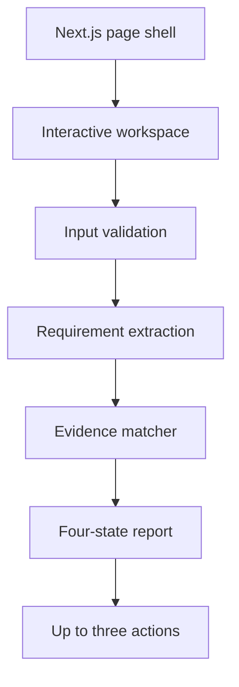

# Web Architecture — Stage 2 Foundation

**Status:** Implemented foundation, approved 2026-10-01

**Production app:** `web/`

**Fallback prototype:** `prototype/`

## Purpose

The production foundation preserves the smallest approved course flow: a student or recent graduate pastes a CV and one job description, receives a transparent four-state evidence report, and sees up to three priority actions. It does not yet authenticate users, upload files, store CVs, or call an AI provider.

## Runtime flow

All current analysis executes in the browser. No CV or JD leaves the page during Stage 2.

## Module boundaries

| Path | Responsibility |
|---|---|
| `web/src/app/` | App Router page shell, metadata, global styles, 404 and error boundaries |
| `web/src/components/` | Interactive CV/JD workspace and its responsive presentation |
| `web/src/domain/analysis/types.ts` | Stable analysis input/output and evidence-state contracts |
| `web/src/domain/analysis/analyzer.ts` | Deterministic extraction, evidence selection, classification, validation, and action generation |
| `web/src/domain/analysis/fixtures.ts` | Fictional, demo-safe CV and JD |
| `web/src/**/*.test.ts(x)` | Domain and interaction tests |
| `prototype/` | Static fallback and historical v0.2 reference; not the production code path |

## Evidence contract

Each recognized job requirement returns:

- `requirement`: normalized requirement name;
- `status`: `supported`, `partial`, `unclear`, or `missing`;
- `evidence`: the exact selected CV excerpt, or `null` when none is found.

The matcher selects the strongest available passage: action-based evidence before limited/familiarity wording, then a plain skill mention. A missing passage is never converted into a claim that the user lacks the ability.

## Current trust boundary

- CV and JD values remain React state in the browser.
- Refreshing or closing the page discards the values.
- There is no API route, database, account, analytics integration, upload, or AI provider.
- Demo fixtures are fictional and contain no personal contact details.
- Results are explanatory text, not a hiring score or hiring probability.

## Approved next boundaries

Grounded CV improvement is the next product slice after Stage 2 review. Supabase, authentication, persistence, PDF/DOCX upload, and external AI remain separate approval gates. When an AI provider is approved, calls must be server-side, schema-validated, prompt-injection-resistant, and traceable to user-provided facts.
