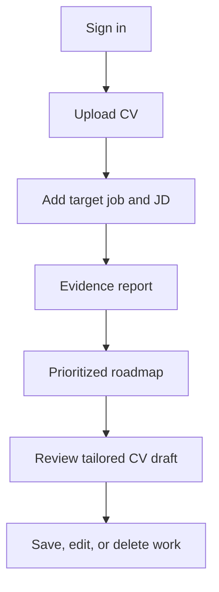
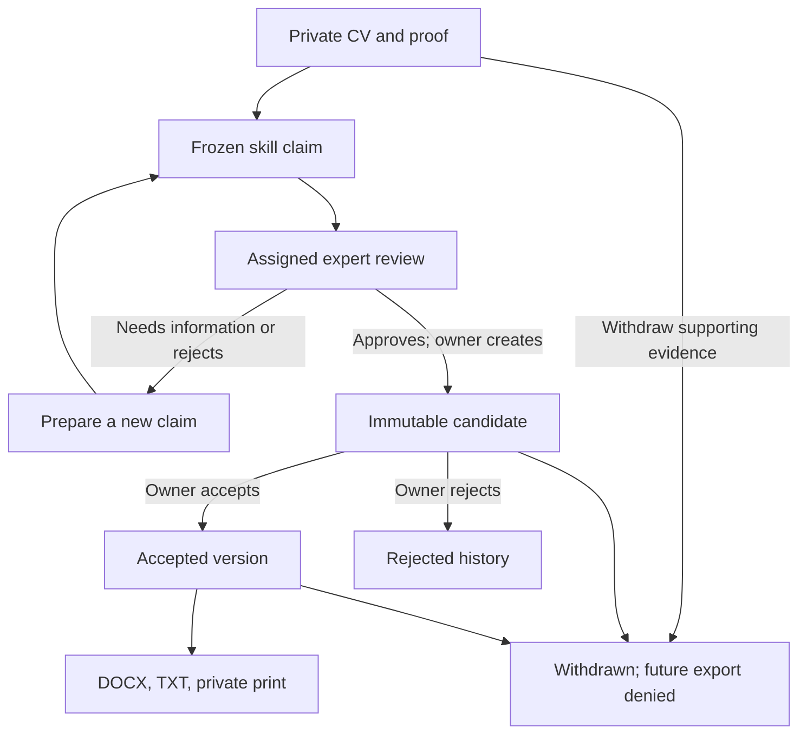
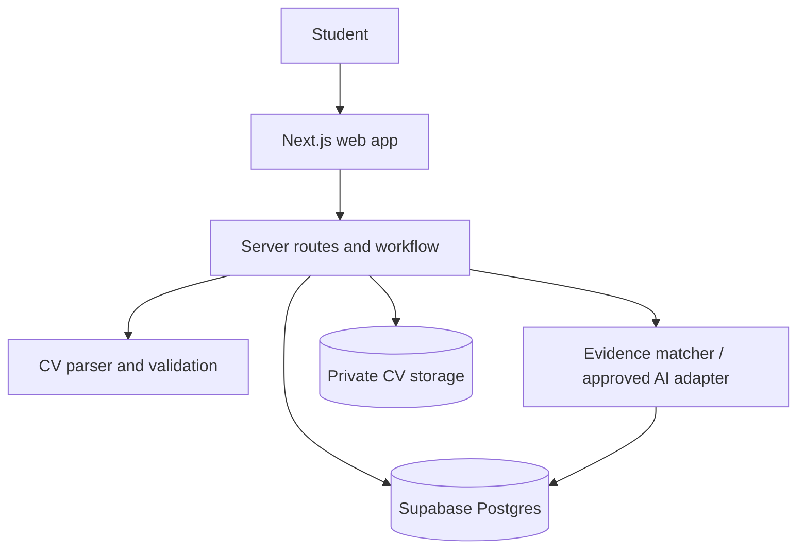

# EXE101 Web App — Master Plan and Progress Report

**Project:** EXE — AI Career Readiness Platform
**Report owner:** Project owner / team
**Last updated:** 2026-10-05
**Working branch:** `codex/exe-web-app-m11c-proof-review`
**Live status:** Nothing is merged to `main`, deployed, or available to real users.

This is the single working report for the web app. It combines the product map, course delivery plan, engineering milestones, current evidence, decisions, acceptance checks, and next actions. Update this file whenever a section is completed.

## Current status — M11C.1

**Original published M11C implementation:** `7738159434cb732ca94095d6a5db4b4e388a9eac`. Prior synthetic acceptance head: `b7807e5c8cd1711c84fff2354923ac6eb5921629`. `main` remains at `d956118e3b89eb1fdcfd10fb48a45ba150fec20a`; no merge or deployment occurred.

**M11C.1 verification — 2026-10-05:** Clean checkout fetched and fast-forwarded on `codex/exe-web-app-m11c-proof-review` to exact starting SHA `4117575126f3c2163582d5bf6a2fb20bc1f641c9`. This stage hardens existing behavior: invalidate cached history/candidate controls after confirmed withdrawal with pending file deletion; accurately mark invalid required proposal fields; associate expert proof acknowledgement with its validation error. Required install, five-step verification (301 tests/37 files/build), proof-preview, workspace UI, genuine synthetic local Supabase journey and cleanup, both CP2 validators, and whitespace checks passed. See the dated [M11C.1 acceptance record](M11C_ACCEPTANCE.md#m11c1--existing-flow-reliability-and-accessibility-hardening--2026-10-05) for exact commands, audit findings and limits. The tested code is the M11C.1 change set on this starting SHA; its publication commit is reported after commit/push. Manual owner review remains pending.

**Current CP2 evidence/decision preparation — 2026-10-05:** Started from clean `69013a148a57b3b5a6d4aa62bd6c354e0a42eb81`; fetched/fast-forward checked the same review branch (already current). Local main confirmed `d956118e3b89eb1fdcfd10fb48a45ba150fec20a`. No actual recent manual owner results or primary-research results were found; unrecorded activity details remain Unknown, and no manual activity was performed in this task. [Inventory and gate packet](evidence/CP2_GATE_RECONCILIATION_2026-10-05.md) maps source CM-009 to register EDU-001 and preserves the nine collected rows / zero owner-reviewed status verified by `pnpm cp2:validate:collected`. `pnpm cp2:sources:validate -- --file docs/evidence/cp2-public-source-log-2026-10-05.md` passed structural completeness only. Earlier repository-side follow-ups recorded Jobie timeout, Jobscan pricing with no readable content, and a MOET Page not found response. A subsequent independent web retrieval directly opened official FitCV, TopCV, Rezi, and Jobscan tools pages; Jobscan pricing still had no readable public details. Direct Jobie, NSO, and MOET requests timed out in that separate session. See the [supplementary source snapshot](evidence/CP2_PUBLIC_SOURCE_SNAPSHOT_2026-10-05.md). This retrieval reports displayed-page content only; no checkout, purchase, source adoption, or owner/team review occurred. All nine source rows remain pending, with zero owner-reviewed. User-friendliness and affordability remain owner-stated hypotheses; actual decision fields and feature approval remain pending. No outreach, primary collection, source-review approval, app feature or deployment occurred. App/browser suites: Not performed in this documentation-only task; prior automated results remain historical. Final diff/whitespace/privacy and staged scope review precede documentation publication on the review branch only.

M11C is implemented from exact published M11B.1 `e15d9584fa67230024ed21cc6258f29a1353726b`. On 2026-10-05 the owner reran the complete synthetic local Supabase browser journey at `b7807e5`; every browser step passed and run-scoped synthetic account/object cleanup passed. Manual owner/accessibility review and CP2 remain pending. Historical failures below are retained as run history. Owner-directed M11A–M11C prototypes are authorized; broader evidence-selected product expansion and market claims remain gated by CP2.

Owner reruns on 2026-10-05: `pnpm review:verify` passed all five checks (including 300 tests/37 files and production build); `pnpm test:proof-preview` and `pnpm test:workspace-ui` passed. Migration versions `20261001`–`20261007` matched. Earlier runs isolated a Playwright text-selector collision: API state was `submitted`, while an unscoped locator also encountered a same-text filter option. At `b7807e5`, the claim-card paragraph selector passed, followed by every owner, expert, denial, acceptance/export, withdrawal/stale-export, and responsive-layout journey. The run-scoped synthetic accounts and private objects were cleaned up. This confirms local automated acceptance; it does not substitute for manual owner review, accessibility review, CP2, or release approval.

| Track | Current status | Evidence / next action |
|---|---|---|
| Core CV → JD → report → roadmap → grounded draft → saved work | Implemented; prior fictional local policy acceptance passed | Manual owner review still pending |
| Private proof → expert review → immutable CV version → owner acceptance → export | Implemented; owner synthetic local browser journey passed on `b7807e5` | All journey steps and fixture cleanup passed; manual usability/accessibility review remains pending |
| M11C proof/workflow improvements | Implementation and local synthetic integration acceptance passed | 300 tests/37 files and owner verification/build passed; proof-preview, workspace UI, and full local Supabase journey passed |
| Local automated verification | M11C.1 rerun passed on the existing local Supabase stack | Current run passed preflight, full verification, both isolated browser suites and genuine synthetic journey with cleanup; manual owner review remains pending |
| CP2 / target segment / pricing / competitiveness | Evidence collection pending | Seven public vendor records plus two official national context sources (CM-001–CM-009) were recorded on 2026-10-05 in `docs/evidence/CP2_PUBLIC_SOURCE_SNAPSHOT_2026-10-05.md`; owner/team review, course clarification, and primary research remain pending. A bilingual instructor clarification draft is prepared but not sent. No segment, price, differentiation, or product-direction decision is approved. |
| Real experts, privacy/backup/retention and real data | Approval pending | Team must review qualification, role/revocation/conflict and data-handling policies |
| Main / deployment / release | Owner decision pending | Feature-branch source review only; no PR, main merge or deployment |

M11C adds controlled private image proof pages with PDF-download guidance, fresh expert decision/checkbox state for every assignment, source-CV history labels/filters, a next-step summary, new-claim preparation from rejected/incomplete wording, safe deletion/refresh recovery, and stale-panel closure. No database/RLS/Storage or authority change. See [actual results](M11C_ACCEPTANCE.md) and [implementation/resume guide](M11C_PROOF_REVIEW_AND_WORKFLOW.md).

## 1. Product map

### Product purpose

EXE helps a student or recent graduate compare their existing CV with one specific job description, understand what their CV actually supports, decide what to improve, and prepare a clearer role-specific CV without inventing qualifications.

### Core user

The first validated target segment is still open. The working hypothesis is students and recent graduates applying for internships or junior roles. CP2 research must choose one segment and job family before public launch or pricing decisions.

### Core promise

> From CV and job description to checkable evidence, clear gaps, practical next actions, and a truthful tailored CV draft.

### What makes it useful

| User problem | EXE response | Product rule |
|---|---|---|
| A job seeker does not know whether their CV demonstrates a job requirement. | Show a requirement-by-requirement finding with the relevant CV excerpt. | Evidence before claims. |
| Generic CV tools rewrite text without explaining gaps. | Label each requirement as supported, partly supported, unclear, or missing. | No opaque hiring score. |
| People need a practical next step. | Create a short roadmap tied to the gaps. | Actions must link to a specific finding. |
| Tailoring a CV can introduce false claims. | Create an editable draft with source provenance for every proposed claim. | Never invent skills, experience, metrics, or credentials. |
| CVs contain personal data. | Store documents privately with owner-scoped access and deletion controls. | Do not use real data before privacy review. |
| A learner wants new qualifications added truthfully. | Require certificate/degree evidence, assigned team-approved expert review of exact wording, then separate owner acceptance of an immutable candidate. | Upload, approval and owner acceptance are separate; no issuer-authentication claim. |

### End-to-end user journey

### Credential-version journey

### MVP boundaries

| Included in the course MVP | Deliberately deferred |
|---|---|
| Sign-in, private PDF/DOCX CV intake, pasted job description, evidence report, roadmap, grounded editable CV draft, saved work, deletion controls, responsive loading/error states | Payments, subscriptions, recruiter marketplace, job scraping, automatic job alerts, social profiles, mobile app, skill exams, automated public-profile collection |

## 2. Architecture map

| Area | Current implementation | Status |
|---|---|---|
| Web app | Next.js 16 + TypeScript + responsive assessment/report screens | Built |
| Identity | Supabase authenticated session access | Built; local acceptance passed in M1 |
| CV storage | Private owner-prefixed Supabase bucket; PDF/DOCX only; 5 MiB maximum | Built; local acceptance passed in M1 |
| Parsing | Server-side PDF/DOCX validation and normalized text extraction | Built |
| Target jobs | Owner-scoped role, company, and pasted job description | Built |
| Analysis | Server-side deterministic wording matcher; schema validation and traceable excerpts | Built in M2 |
| AI provider | No vendor selected and no CV/JD text sent externally | Open decision |
| Roadmap | Gap-linked actions, priority, rationale, and user-controlled progress | Built; prior local policy acceptance passed |
| CV drafting | Source-grounded editable draft with per-claim provenance and explicit acceptance | Built; prior local policy acceptance passed |
| Saved history / polish | Saved core work, empty/loading/error states, security and responsive review | Built in M4/M10.2; owner review pending |
| Credential versions | Private proof/optional portfolio, frozen claim, assigned expert decision, immutable history and explicit acceptance | Built in M11A; prior local policy acceptance passed |
| Accepted exports | Saved-text DOCX/TXT and private browser print with fresh owner/provenance checks | Built in M11B; M11B.1 synthetic authenticated journey passed |
| Credential usability / proof display | Source-aware filters, workflow summary, safe refresh/errors and controlled raster proof view | Built in M11C; isolated checks passed, local integration pending |

### Route map

| Route | Purpose | Access / boundary |
|---|---|---|
| `/` | Overview and fictional example | Public shell; no real job/price/market claim |
| `/assessment` | Sign in, private CV intake and target JD | Authenticated persistence; PDF/DOCX CV up to 5 MiB |
| `/analysis/[id]` | Four-state evidence report and private sharing controls | Owner report; deterministic local wording analysis |
| `/analysis/[id]/next-steps` | Gap roadmap and editable grounded M3 draft | Owner only; editing clears draft acceptance |
| `/saved-work` | Return to saved reports/drafts | Owner-scoped minimal metadata |
| `/opportunities` | Save a user-found HTTPS reference and process state | Owner only; no external fetch/scrape/vacancy verification |
| `/review/[token]` | Selected report/accepted draft and advisory feedback | Narrow unlisted token, expiry/revocation; does not confer expert authority |
| `/credential-versions` | Private evidence, claims, CV history and owner acceptance | Authenticated owner data; source/next-step filters |
| `/expert/credential-reviews` | Assigned submitted claims and immutable expert decision | Authenticated active team-approved expert, exact assignment, no self-review |
| `/api/credential-versions/evidence/[id]` | Authorized private proof/portfolio delivery and proof view | Existing owner/assignment RPC + private Storage; no public URLs |
| `/api/credential-versions/[id]/export` | DOCX/TXT of saved accepted text | Owner, historical acceptance and complete active provenance required |
| `/credential-versions/[id]/print` | Private browser Print / Save as PDF | Same accepted-export boundary; no generated PDF download |

## 3. Engineering milestone plan

| Milestone | Scope and acceptance target | Status | Evidence / remaining work |
|---|---|---|---|
| **M0 — Web app shell** | Responsive UI, fictional report preview, CV/JD entry, browser-only validation | Complete; owner review pending | Build, lint, and typecheck passed. Branch: `codex/exe-web-app-m0`. |
| **M1 — Secure intake and identity** | Auth, private CV storage, PDF/DOCX parse, saved target jobs, replace/delete, ownership policies | Complete; accepted as M2 baseline | Two-user local Supabase RLS/private-Storage acceptance passed on 2026-10-01. Branch: `codex/exe-web-app-m1`, commit `7909dc8`. |
| **M2 — Evidence-based analysis** | Requirements, supported/partly supported/unclear/missing findings, excerpts, caveats, saved runs | Local Supabase acceptance passed; owner review pending | Two-user M1/M2/M3 RLS, private Storage, retry uniqueness, and deletion-cascade acceptance passed locally on 2026-10-02. Branch: `codex/exe-web-app-m2`. |
| **M3 — Roadmap and grounded CV draft** | Prioritized gap-linked actions; editable CV draft with claim provenance and review | Local Supabase acceptance passed; owner review pending | The local source composer remains provider-free. Two-user roadmap, draft, provenance, and deletion-cascade checks passed locally on 2026-10-02. |
| **M4 — Saved work and integration polish** | Minimal history, full core flow, error/empty states, responsive and privacy review | Complete; owner review pending | Private saved-work API/DTO, mobile-safe history UI, navigation, and calm state handling are implemented. All quality checks and local Supabase acceptance passed on 2026-10-02. |
| **M5 — CP1 Slot 8 demo readiness** | Fictional local demo package, 3–5 minute runbook, setup checklist, product/service and technology descriptions | Demo package complete; owner/course review pending | `45188c5`; fictional fixture and local acceptance passed; no course checkpoint marked complete. |
| **M6a — Private review links and feedback** | Private, revocable, expiry-limited sharing of one completed report and optional accepted draft | Implemented; final verification and owner review pending | Branch `codex/exe-web-app-m6` from `45188c5`; owner controls, narrow public reviewer route, hashed tokens, RLS/RPC boundary, and fictional local acceptance are implemented. |
| **M6b — Private opportunity links and curated-source framework** | Owner-saved external HTTPS reference links with private process status; future curation contract only | Implemented; final owner review pending | Branch `codex/exe-web-app-m6b` from `4ccb54d`; RLS, same-owner target-job guard, HTTPS validation, local acceptance, and empty curation framework are complete. No external fetching, scraping, or unverified listings. |
| **M7 — Internal release candidate** | Cross-route privacy/security audit, fictional acceptance evidence, CI, and owner-release package | Ready for owner review | Branch `codex/exe-web-app-m7` from clean M6b `4527301`; 54 tests, local M1–M6b fictional Supabase acceptance, security hardening, release checklist, CI, and owner handoff are complete. No deployment occurred. Owner must complete connected-browser desktop/narrow-mobile visual and keyboard review and make every release decision explicitly. |
| **M8 — Research and owner-review package** | CP2 plan, interview/survey tools, blank evidence register, alternative/pricing template, and owner execution checklist | Prepared — evidence collection pending | Branch `codex/exe-web-app-m8` from M7 `13eab1b`; templates contain no collected participant, competitor, pricing, or market evidence. Pricing, competitive, value, and validation claims remain blocked pending reviewed CP2 evidence. |
| **M9 — Evidence gate and product-decision workflow** | CP2 register validator, evidence-review template, decision gate, next-feature matrix, and owner status | Evidence gate prepared — CP2 evidence pending | Branch `codex/exe-web-app-m9` from M8 `8755795`; no code feature was selected or built. [Validator](../scripts/validate-cp2-evidence.mjs) checks template/collected-register structure and safety but cannot validate research quality; see the [decision gate](M9_DECISION_GATE.md). M11 feature selection depends on owner/team evidence review. No merge or deployment occurred. |
| **M10 — CP2 research execution workspace** | CP2 execution status, research-session log, product-direction decision record, and owner gate | Evidence collection pending | The 2026-10-02 review found only example/template material. On 2026-10-05, seven vendor-page observations and two official national context sources (CM-001–CM-009) were added with limitations. A bilingual instructor clarification draft is prepared, not sent. Owner/team review, actual course clarification, primary research, and the product-direction decision remain pending. No feature was selected. No merge or deployment occurred. |
| **Release review** | Final owner review, security/privacy review, course demo preparation | Planned | Requires explicit owner approval before a merge or any deployment. |
| **M10.2 — Existing-experience hardening** | Existing route clarity, keyboard/form access, responsive safeguards, safe errors and regression coverage | Engineering checks passed — owner manual review pending | From exact M10 baseline `4af832c`; 115 tests in 22 files, lint/typecheck/build, script syntax, CP2 template/diff and local fictional Supabase acceptance passed. Seven routes hardened; browser disconnected, so viewport/zoom/keyboard/assistive-technology review remains owner follow-up. See `M10_2_HARDENING_ACCEPTANCE.md`. CP2 remains pending, M11 remains blocked, and no price, market, competitor, validation, privacy-superiority or ease-of-use claim is unlocked. No merge or deployment occurred. |
| **M10.5 — Local owner-review preflight** | Local fictional-data configuration guard and preflight command | Engineering checks passed — owner browser review pending | From M10.3 `9d9e3c2`; `pnpm review:preflight` permits only local public Supabase browser settings, rejects private credentials/hosted URLs without printing values, and checks the fictional DOCX/checklist. Full tests passed: 179 tests in 24 files; lint, typecheck, build, direct synthetic checks, and diff check also passed. A sandbox-only child-process diagnostic was resolved by a full outside-sandbox rerun and is recorded in `M10_5_QA_PREFLIGHT_ACCEPTANCE.md`. No app feature, CP2 evidence, M11 selection, merge, or deployment occurred. |
| **M10.3 — Research operations** | Aggregate survey/source-log validation and private local tooling | Prepared — evidence pending | 175 historical tests; templates/synthetic fixtures are not research results. |
| **M10.6 — Verification runner** | Preflight → lint → typecheck → tests → build | Published; original local gate passed | `5dd5fbebf688aeafe20ecc91cb55838bdc5d851e`; no manual/CP2 approval implied. |
| **M11A — Credential-gated CV versions** | Private proof, assigned expert, immutable candidates and explicit owner acceptance | Published; original local policy/code gate passed | `bc24377d57d503a21059ee0a467ede23252f289a`; role/privacy/manual review pending. |
| **M11B — Accepted CV exports** | DOCX/TXT and private browser print; cumulative provenance | Published; code gate passed | `64b0dc9e0c138ae31ed0eda102a783f0db9137b5`; external-editor and print-pagination review pending. |
| **M11B.1 — Genuine local browser acceptance** | Real local synthetic authentication, upload/review/accept/export/withdrawal and denials | Published; baseline journey and cleanup passed | `e15d9584fa67230024ed21cc6258f29a1353726b`; 281 historical tests; no human approval or CP2 evidence. |
| **M11C — Proof review and workflow usability** | Controlled raster proof view, fresh expert form, source-aware history, guidance and recovery | Implemented; isolated and genuine local synthetic browser acceptance passed | Owner reported verification/build, both isolated browser suites, full synthetic local journey and cleanup passed; manual owner/accessibility review, CP2 and release gates remain open. See `M11C_ACCEPTANCE.md`. |

## M10.3 research operations status — 2026-10-02

Toolkit prepared from verified M10.2 `bd34743`: root-anchored private research ignore rules, local survey CSV/JSON aggregate validator, deterministic neutral summary, public-source log completeness validator, synthetic fixtures/tests, schemas, data-boundary/analysis guide and owner handoff. Final 175 tests in 23 files, lint/typecheck/build, all required syntax/template/synthetic CLI/diff checks and fictional local Supabase acceptance passed; see `M10_3_RESEARCH_OPS_ACCEPTANCE.md`.

No evidence was collected automatically or entered in the register. Target segment/job family remain open; no price, competitor, market, validation, privacy-superiority or ease claim is unlocked. CP2 remains pending and M11 blocked. M7/M10.2 owner browser reviews remain pending. The job-seeker app workflow is unchanged. No merge or deployment occurred.

## M10.5 local owner-review preflight status — 2026-10-02

Prepared from verified M10.3 `9d9e3c2`: `pnpm review:preflight` checks only a local `.env.local` before the fictional owner review. It requires the two public browser settings, allows only an HTTP loopback Supabase URL, rejects private credential settings without echoing values, and confirms the fictional Aria Vale DOCX/checklist. It makes no network request or write and does not inspect a CV, job description, research record, or browser session.

Targeted preflight tests, lint, typecheck, production build, direct synthetic CP2 CLI checks, and diff check passed. The full test suite also passed outside the sandbox: 179 tests in 24 files. An initial sandbox-only child-process capture issue (including `git check-ignore`) was resolved by this full rerun and is retained only as diagnostic context. Manual browser review, real CP2 evidence, M11 selection, merge, and deployment remain pending. See `M10_5_QA_PREFLIGHT.md` and `M10_5_QA_PREFLIGHT_ACCEPTANCE.md`.

## M10.6 local verification status — rerun 2026-10-03

Completed engineering work: runner, package command, 10 deterministic injected regressions and owner handoff on the exact remote M10.5 baseline `aaee9f93d366f61ab2f284cdab363fa6cb582300`. `pnpm review:verify` runs `pnpm review:preflight`, `pnpm lint`, `pnpm typecheck`, `pnpm test`, `pnpm build` in that exact order with inherited output, step timing, first-failure status, and all-pass-only engineering summary. No new dependencies, network client, real data handling, or automatic Supabase/Docker operations.

Actual final checks: `pnpm run review:verify` passed preflight, lint, typecheck, full 189 tests in 25 files and local build (telemetry disabled) in the required order. CP2 template validation and diff checks passed. Earlier missing-configuration failures were resolved when local configuration became available; no configuration values were printed or staged. See `M10_6_REVIEW_VERIFY_ACCEPTANCE.md`.

Not performed: `pnpm test:supabase:local` — no database/API/RLS/Storage change; manual browser/mobile/keyboard/screen-reader/accessibility review, privacy approval, real CP2 collection/review, M11 selection, merge, deployment, or owner approval. Pending owner action: configure only the existing local stack's public settings, run `pnpm review:verify` then (only after success) `pnpm dev`, use only the fictional DOCX in `docs/demo/fixtures/`, and complete `M10_2_OWNER_REVIEW.md` with actual date/viewport/keyboard actions/issues/retests. Reuse an already-running local Supabase stack; do not start a duplicate merely because port `54322` is occupied.

Blocked decisions: M11 remains blocked by the documented CP2 gate; evidence-based claims remain blocked. Automation is not manual owner-review evidence or CP2 completion. No merge to main or deployment; explicit owner approval required. See `M10_6_REVIEW_VERIFY.md`.

## M11A owner-directed technical prototype — 2026-10-03

The owner explicitly approved this technical prototype after the controlled M10.6 completion/publication. Exact base: `5dd5fbebf688aeafe20ecc91cb55838bdc5d851e`; feature branch `codex/exe-web-app-m11a-credentialed-cv-versions`. This approval authorizes implementation, not CP2 validation, pricing/market/competitor claims, real data, real expert enrollment, merge, deployment or release.

Prepared engineering work: private portfolio/certificate/degree intake; bounded frozen skill claims; team-authorized authenticated expert assignments/decisions; approved-only immutable candidates; explicit owner acceptance; cumulative provenance and truthful withdrawal. Seven new RLS-protected record types and two private buckets; checked server/database transitions and safe list/download boundaries. Original CVs, M3 drafts and token-based advisory review links are preserved. No OCR, inference, issuer API, external AI, scraping, payments or exports. See `M11A_CREDENTIAL_GATED_CV_VERSIONING.md`.

Engineering gate passed: 35 targeted tests; `pnpm review:verify` passed preflight, lint, typecheck, 224 tests in 29 files and build; CP2 template validation passed; existing local-stack M1–M6b/M11A fictional RLS/private Storage acceptance passed after both migrations. Initial interaction and new test-hook failures were diagnosed and resolved, as recorded in `M11A_CREDENTIAL_GATED_CV_VERSIONING_ACCEPTANCE.md`. Final review added before/after comparison, individual claim withdrawal, sandboxed private proof previews, first-invalid focus, explicit expert approval metadata and lifecycle timestamps. Not performed: manual browser/mobile/screen-reader/accessibility review, real expert approvals, CP2 evidence collection or public release. Expert-role administration policy and privacy/backup/retention review remain pending. Broader M11 evidence-based product decisions remain gated by CP2; explicit owner approval required before merge/deployment.

## M11B owner-directed accepted CV export prototype — 2026-10-04

Owner requested export from exact published M11A `bc24377d57d503a21059ee0a467ede23252f289a` on `codex/exe-web-app-m11b-cv-export`. Implemented in-memory editable DOCX, byte-exact UTF-8 TXT fallback, private browser Print / Save as PDF, owner/state/acceptance/cumulative-provenance checks, escaped print text, sanitized private headers, and accessible history actions. Saved snapshots are the only CV text source; no claims are rewritten or generated, and no proof metadata/expert identity is included. No database/RLS/Storage or approval/acceptance/withdrawal authority change. New `docx` dependency is documented in `M11B_ACCEPTED_CV_EXPORT.md`.

Engineering gate/source review passed: 48 targeted tests in 5 files; standalone preflight; `pnpm review:verify` passed preflight, lint, typecheck, 266 tests in 33 files and build; CP2 template validation and diff checks passed. Actual results and scope scan are recorded in `M11B_ACCEPTED_CV_EXPORT_ACCEPTANCE.md`. Local policy suite not performed because database/RLS/Storage behavior is unchanged. Print uses the browser, not a generated PDF download. M11A manual owner/accessibility review, CP2 research, broader product validation and privacy/role policies remain pending. No PR, merge, deployment, public/live release, or release approval occurred.

## M11B.1 local browser acceptance — 2026-10-04

From exact published M11B `64b0dc9e0c138ae31ed0eda102a783f0db9137b5`: separate `pnpm test:e2e:local` with pinned Playwright 1.61.1/cached Chromium, real local authentication, temporary synthetic owner/assigned expert/ordinary/unassigned-expert accounts, run-scoped cleanup, isolated owned Next.js server, restricted loopback networking and content-free reporting. Automated synthetic approval/owner acceptance, editable DOCX/TXT/print-view, denial/withdrawal/stale-action and five-width keyboard/overflow assertions passed. One observed 320px intrinsic grid/fieldset overflow fixed narrowly; native proof-preview compatibility remains a manual follow-up, with authenticated proof downloads tested. Engineering gate passed: browser suite/verified cleanup, 21 targeted tests, preflight, five-step verification (281 tests in 35 files), CP2 template and whitespace checks; final source/staged review precedes publication. See `M11B_1_LOCAL_BROWSER_ACCEPTANCE_ACCEPTANCE.md`. Not performed — browser harness only; no database/RLS/Storage changes: `pnpm test:supabase:local`. M11A manual owner review, M11B printing/pagination/editor review, CP2, policies, merge/deployment/release approval remain pending; manual/evidence records untouched.

## 4. M2 status and acceptance record

### Delivered

- Requirement extraction from the job description, capped at 12 requirements.
- Four user-facing findings: **supported**, **partly supported**, **unclear**, and **missing**.
- Exact CV excerpts plus offsets for wording evidence.
- Clear labels for self-reported CV claims and example context.
- No numerical hiring score, proficiency verdict, or job-offer prediction.
- No external AI calls. The current `local-evidence` adapter is deterministic wording matching only.
- Saved, owner-scoped analysis runs and findings with retry-safe request IDs.
- Owner-scoped database policies; source-CV deletion cascades to stored evidence.
- Report screen, processing state, retry path, and accessible plain-language limits.

### Automated checks already passed

| Check | Result |
|---|---|
| `pnpm test` | Passed: 5 test files, 33 tests |
| `pnpm lint` | Passed |
| `pnpm typecheck` | Passed |
| `pnpm build` | Passed |
| `node --check scripts/m1-local-policy-check.mjs` | Passed |
| `git diff --check` | Passed |

### M2 local acceptance

| Check | Why it matters | Current state | Completion command |
|---|---|---|---|
| Two-user local Supabase analysis RLS | Confirms users cannot read or write another user's analysis or findings | Passed 2026-10-02 | `pnpm dlx supabase start`; environment from `pnpm dlx supabase status -o env`; `pnpm test:supabase:local` |
| Cross-owner CV/job reference denial | Prevents an analysis run using another user's CV or JD | Passed 2026-10-02 | Included in the fictional-data acceptance script |
| Retry request uniqueness | Prevents duplicate reports after a network retry | Passed 2026-10-02 | Included in the fictional-data acceptance script |
| CV deletion cascade | Removes derived evidence with the source CV | Passed 2026-10-02 | Included in the fictional-data acceptance script |
| Owner UX review | Confirms wording is clear and useful for job seekers | Pending | Review the M2 branch with fictional data |

## 5. M3 implementation and acceptance record

M3 converts the M2 report into actions a job seeker can use. It stays evidence-grounded and uses fictional test data until the privacy, data retention, and AI-provider decisions are complete.

| Section | Build work | Acceptance criteria |
|---|---|---|
| Roadmap generation | Completed: derives up to five actions from missing, partial, and unclear findings | Every item saves the linked requirement, finding status, priority, action, rationale, and user-controlled progress state |
| Roadmap review | Completed: private screen shows priority, rationale, and progress control | A completed action records user progress and is never treated as skill verification |
| Grounded CV draft | Completed: composes only supported or partial evidence excerpts already found in the CV | Each generated claim stores its requirement, exact excerpt, and source offsets; no new facts or metrics are generated |
| Draft editing | Completed: direct editing, save, and explicit acceptance are available | Any edit clears prior acceptance and is labelled as the user's responsibility to verify |
| Safety checks | Completed: unit tests cover linked actions and source-only claim selection | The local composer excludes missing and unclear findings from the generated draft |
| Persistence and privacy | Implemented: owner-scoped roadmap, draft, and claim tables with deletion cascades | Passed local two-user RLS/cascade acceptance with Docker Supabase on 2026-10-02 |

## 6. M4 saved work and integration polish

### Delivered

- Added the private `/saved-work` workspace and owner-scoped `/api/saved-work` endpoint.
- The list returns only target role, optional company, CV filename, report dates/status, four derived finding counts, draft existence, and draft acceptance state. It never returns CV/JD text, excerpts, owner IDs, storage paths, or provider configuration.
- Added calm empty, loading, private-session/error, processing, failed-report retry, no-next-steps, and draft-review states.
- Added clear Saved work navigation from the overview, assessment, report, and next-step screens.
- Reviewed and adjusted responsive behavior for desktop and narrow mobile: wrapping long titles and filenames, reachability of actions, visible keyboard focus, status text that does not rely on colour, and labelled controls.
- Kept the deterministic local analysis/composer path. No external provider receives CV or job-description text.

### M4 verification

| Check | Result |
|---|---|
| `pnpm test` | Passed: 7 test files, 40 tests, including authenticated owner query scoping, unauthenticated rejection, cross-run metadata exclusion, derived summary counts, and empty data handling. |
| `pnpm lint` | Passed |
| `pnpm typecheck` | Passed |
| `pnpm build` | Passed; includes `/saved-work` and `/api/saved-work` |
| `node --check scripts/m1-local-policy-check.mjs` | Passed |
| `git diff --check` | Passed |
| `pnpm test:supabase:local` | Passed again against the isolated local Docker Supabase stack using temporary fictional users and content only. |

### Remaining limitations

- The saved-work list is intentionally a concise return-to-work index, not a source-data browser; users reopen a private report or draft for detail.
- A reviewed Supabase environment, backup/retention review, and owner privacy/security review are still required before accepting real CVs.
- M4 does not add payments, pricing claims, deployment, sharing, job links, or an external AI provider.

## 7. Course delivery map

Engineering progress does not automatically complete a course checkpoint. Each checkpoint needs its own evidence and team review.

| Checkpoint | Course requirement | Current status | Needed evidence |
|---|---|---|---|
| **CP1 — Idea lock** | Product/service description, target-user hypothesis, problem, value proposition, MVP boundary | Course acceptance unknown | Existing scope/description; owner/instructor idea-lock result not supplied |
| **CP2 — Market research** | Survey of more than 100 responses or two qualified industry experts; 5–10 customer interviews; competitor, market, value, and price research | Tools prepared; evidence/review pending | Dated sources, anonymized notes, consent approach, competitor matrix, and revised segment/value proposition |
| **CP1 — MVP demo** | End-to-end product demo plus product and technology description | Package prepared; rehearsal/course review pending | Fictional M5 fixture and runbook; actual demonstration results not supplied |
| **CP3 — BMC** | Business Model Canvas supported by research or clearly labelled assumptions | Not started | BMC and evidence links |
| **CP4 — Pitch deck** | Team, product-market fit, business model, operations, fundraising plan | Not started | Slide deck, speaker plan, and research-supported claims |
| **Constructivism presentation** | Separate 15% assessment; rubric still needs confirmation | Not started | Instructor-confirmed rubric and working evidence log |

### CP2 research work that must happen before pricing claims

1. Select the primary job-seeker segment and sampling plan.
2. Conduct the required survey or expert interviews, then 5–10 target-user video interviews with consent-safe notes.
3. Compare current alternatives, including their pricing, privacy terms, and evidence quality.
4. Ask what users do today, where it fails, which feature matters most, use intent, and willingness to pay.
5. Label every claim as research evidence, estimate, assumption, or open question.
6. Use the findings to decide the initial segment, value proposition, and pricing. A lower price remains a hypothesis until this research exists.

## 8. Product and technical decisions

| Decision | Status | Reason / next action |
|---|---|---|
| Next.js + TypeScript web app | In use | Existing application foundation; record any stack change before making it. |
| Supabase Auth, Postgres, and private Storage | In use across private workflows | Prior local ownership/policy acceptance passed; review backup/retention before real CVs. |
| PDF and DOCX only; 5 MiB maximum | Approved for M1 | Server validates extension, signatures, and DOCX archive structure. |
| Deterministic local analysis adapter | Reversible M2 choice | Avoids external CV/JD sharing while AI-provider data handling is unresolved. |
| External AI provider | Open | Choose only after cost, privacy, retention, consent, and output-evaluation review. |
| Numeric match score | Excluded from MVP | Categories with evidence are easier to understand and less likely to be mistaken for a hiring prediction. |
| Initial job segment and pricing | Open | Must be based on CP2 research. |
| Product-value, affordability, competitive, and validation claims | Blocked pending CP2 evidence | M8 supplies research templates only; make a claim only from dated, reviewed, relevant evidence. |
| Evidence-selected next product expansion | Blocked pending M9/CP2 decision gate | Owner-directed M11A–M11C engineering is authorized separately; it does not validate demand or market positioning. |
| Merge, deployment, or real-user use | Owner approval required | Keep feature branches reviewable; never deploy or merge without explicit approval. |

## 9. Privacy, security, and quality rules

- Never commit API keys, service-role keys, real CVs, interview recordings, or personally identifying research data.
- Keep CVs private and owner-scoped in both application logic and database/storage policies.
- Treat CV and job-description text as untrusted data; never execute it as instructions.
- Explain external AI data handling and obtain appropriate consent before any such use.
- Validate provider output before saving or displaying it.
- Preserve source evidence for findings and draft claims; mark uncertainty clearly.
- Give users clear delete, retry, loading, and error states.
- Use fictional or consented data in tests, screenshots, presentations, and demos.

## 10. Current work queue

Current priorities take precedence over the historical queue below.

For the current CP2 task, use the [reconciliation packet](evidence/CP2_GATE_RECONCILIATION_2026-10-05.md): obtain actual owner manual observations one activity at a time, accept only genuine anonymized owner-supplied primary results, select sources for owner/team review and resolve relevant checkout/source gaps, then conduct and record the actual evidence/decision review. No new feature gate is complete.

Documentation checks for this task: `pnpm exec vitest run scripts/validate-cp2-evidence.test.mjs scripts/cp2-research.test.mjs` passed 71 tests in 2 files; `pnpm lint` and `git diff --check` passed. Both CP2 validators passed as recorded above. Synthetic tests and structural passes are not research, source accuracy or approval. Six intended Markdown files comprise the reconciliation change set; final staged whitespace and privacy/scope scan precede commit/push.

| Priority | Next work | Status / dependency |
|---:|---|---|
| 1 | M11C.1 existing-flow hardening and genuine local integration | Complete automated verification on 2026-10-05: 301 tests, build, both isolated browser suites and full synthetic local-stack journey/cleanup passed. Manual review remains pending; see `M11C_ACCEPTANCE.md`. |
| 2 | Manual owner experience review | M7/M10.2/M11A checklists; two CV histories, fresh expert acknowledgements, withdrawal/recovery, desktop/mobile/keyboard and screen-reader review. Record only performed activities. |
| 3 | Export fidelity review | Actual browser Print / Save as PDF pagination and opening DOCX in an external editor. |
| 4 | Expert and data-handling policy | Approve qualification/enrollment/revocation/conflict rules, privacy, backup and retention before real users/documents. |
| 5 | CP2 research and evidence-selected decision | Complete consent-safe research/register and team review before selecting segment, prices or comparative claims. |
| 6 | Owner release decision | Explicit merge/deployment approval after relevant checks/reviews; no automatic release. |

| Order | Work item | Status | Owner / dependency |
|---:|---|---|---|
| 1 | Create this single master report | Complete 2026-10-02 | Completed in this branch |
| 2 | Run the expanded M2/M3 two-user acceptance script | Complete 2026-10-02 | Docker plus `pnpm dlx supabase` 2.119.0; fictional local accounts only |
| 3 | Record M2/M3 acceptance result and publish report update on the feature branch | Complete 2026-10-02 | Published in commit `45cc24f` |
| 4 | Build M3 roadmap and source-grounded CV draft | Complete 2026-10-02 | Code checks passed; local policy acceptance and owner review remain |
| 5 | Run CP2 research and approve target segment/value/pricing | Parallel product work | Team evidence and instructor guidance |
| 6 | Build M4 saved work and integration polish | Complete 2026-10-02 | Full quality gate and local acceptance passed; owner review remains |
| 7 | Prepare M5 CP1 Slot 8 demo readiness | Complete — owner/course review pending | Fictional demo data and DOCX fixture, local setup checklist, 3–5 minute runbook, product/service and technology descriptions, failure plan, owner checklist, and final automated checks are complete; owner must still rehearse/review before CP1 is marked complete |
| 8 | Build M6a private review links and feedback | Complete — owner review pending | Selected-report sharing with optional accepted draft, expiry, revocation, review feedback, narrow reviewer route, and fictional-data test evidence implemented |
| 9 | Build M6b private opportunity links and curated-source framework | Complete — owner review pending | Private user-saved HTTPS references, owner RLS/same-owner target-job enforcement/cascade, and an empty curation contract implemented; real curation remains blocked by CP2/team approval |
| 10 | Prepare M7 internal release candidate | Ready for owner review | Security/route audit, full fictional acceptance record, non-deploying CI, and owner review package completed from M6b `4527301`; next action is owner review, not release |
| 11 | Prepare M8 research and owner-review package | Complete — evidence collection pending | M8 templates cover consent-safe interviews, anonymous survey, blank register, current-source comparison, and owner execution; no results collected or claims unlocked |
| 12 | Prepare M9 evidence gate and product-decision workflow | Complete — evidence collection pending | Added validator, deterministic validator tests, review template, decision gate, next-feature matrix, and owner-status checklist. It does not collect evidence, complete CP2, or select a feature. |
| 13 | Run CP2 evidence collection and owner/team review | Pending | Collect and review real consent-safe evidence for segment, value, alternatives, competitor positioning, and willingness to pay; use the collected-evidence validator and record limitations before a product decision. |
| 14 | Select future product expansion from reviewed evidence | Blocked by M10 decision gate | Requires owner-review/research evidence and a recorded decision. M11A–M11C prototypes have separate owner authorization and do not complete that validation. |
| 15 | Final owner review, then decide whether to merge/deploy | Owner decision only | Requires explicit privacy/security and backup/retention review plus explicit approval; no deployment or merge in M9 |

## 11. Progress log

| Date | Completed section | Result | Evidence |
|---|---|---|---|
| 2026-10-01 | M1 local policy acceptance | Passed with temporary fictional users on local Docker Supabase | `7909dc8`; `scripts/m1-local-policy-check.mjs` |
| 2026-10-01 | M2 implementation | Built and published for source review | GitHub commit `c0ab3d7` on `codex/exe-web-app-m2` |
| 2026-10-01 | M2 automated code checks | Passed: 33 unit tests, lint, typecheck, build, syntax/diff checks | `docs/CURRENT_STATE.md` |
| 2026-10-02 | Master project report | Created as the single tracking document | This file |
| 2026-10-02 | M3 roadmap and CV draft | Built private roadmap, source-grounded draft, editing/acceptance controls, owner-scoped storage, and deletion cascade migration | 35 unit tests; lint, typecheck, build, syntax, and diff checks passed |
| 2026-10-02 | M2/M3 local Supabase acceptance | Passed using temporary fictional accounts, CVs, and JDs only | Fixed duplicate Supabase migration versions by renaming M2 to `20261002` and M3 to `20261003`; ran `pnpm dlx supabase start` and `SUPABASE_URL="$API_URL" SUPABASE_PUBLISHABLE_KEY="$PUBLISHABLE_KEY" pnpm test:supabase:local` |
| 2026-10-02 | M4 saved work and integration polish | Completed private saved-work history, return links, responsive/accessibility refinements, and plain-language loading/empty/error states | 40 unit tests, lint, typecheck, build, syntax/diff checks, and a repeated local Supabase acceptance passed; no merge or deployment |
| 2026-10-02 | M5 Section 2 — fictional demo material | Completed demo persona, deterministic expected findings, local environment checklist, and upload fixture | `docs/demo/FICTIONAL_DEMO_DATA.md`; `docs/demo/DEMO_ENVIRONMENT_CHECKLIST.md`; parser-verified 1,489-byte fictional DOCX fixture |
| 2026-10-02 | M5 Section 3 — CP1 Slot 8 package | Completed 3–5 minute core-flow runbook, product/service and technology descriptions, failure plan, and owner review checklist | `docs/demo/CP1_SLOT8_DEMO_RUNBOOK.md`; `docs/demo/PRODUCT_SERVICE_DESCRIPTION.md`; `docs/demo/TECHNOLOGY_TOOLS_DESCRIPTION.md`; `docs/demo/CP1_SLOT8_OWNER_REVIEW_CHECKLIST.md` |
| 2026-10-02 | M5 Section 4 — final verification and tracking | Passed final code gate and fictional-data local Supabase acceptance; demo package marked ready for owner/course review | 40 unit tests, lint, typecheck, build, script syntax/diff checks, and two-user local RLS/Storage/analysis/roadmap/draft/cascade acceptance passed; live browser pixel review remains an owner checklist item because a connected browser was unavailable |
| 2026-10-02 | M6a Section 1 — baseline and branch setup | Passed clean M5 baseline checks; created and pushed M6 branch | Base `45188c5`; 40 tests, lint, typecheck, build, script syntax/diff checks, and fictional local Supabase acceptance passed; `codex/exe-web-app-m6` pushed without touching `main` |
| 2026-10-02 | M6a Section 2 — private review-link design | Defined focused selected-report sharing, hashed tokens, expiry, immediate revocation, anonymous RPC boundary, and exclusions | `docs/PRIVATE_REVIEW_DESIGN.md`; implementation follows in M6a Sections 3–5 |
| 2026-10-02 | M6a Section 3 — secure data model and server access | Implemented migration, owner RLS, direct-anonymous denial, token-hash RPC boundary, accepted-draft guard, and deletion cascade acceptance | `20261004_m6_private_review_links.sql`; local reset applied M1–M6a migrations and the fictional two-user policy suite passed |
| 2026-10-02 | M6a Section 4 — owner workspace UI | Implemented report-level create/copy-once controls, expiry selection, accepted-draft opt-in, owner share management, revoke, and scoped feedback display | `src/app/analysis/[id]/review-links.tsx` and authenticated `/api/analysis/[id]/review-shares` route; raw tokens do not appear in saved share records |
| 2026-10-02 | M6a Section 5 — reviewer UI | Implemented unlisted noindex/no-store reviewer view, neutral unavailable page, selected-content projection, and bounded feedback form | `/review/[token]` never appears in navigation and exposes no owner identity, IDs, source CV/JD, storage path, or unrelated work |
| 2026-10-02 | M6a Section 6 — verification and documentation | Passed final automated checks and reset local Supabase acceptance; documentation updated | 44 unit tests in 9 files, lint, typecheck, build, script syntax/diff checks, and M1–M6a fictional two-user acceptance passed; owner must still complete a live desktop/narrow-mobile review before any presentation or real-data decision |
| 2026-10-02 | M6b Section 1 — baseline and branch setup | Passed clean M6a baseline checks; created and pushed M6b branch | Base `4ccb54d`; 44 tests, lint, typecheck, build, script syntax/diff checks, and M1–M6a fictional local Supabase acceptance passed; `codex/exe-web-app-m6b` pushed without touching `main` |
| 2026-10-02 | M6b Section 2 — opportunity-link design | Defined private user-provided tracker and empty future-curated-source lanes | `docs/OPPORTUNITY_LINKS_DESIGN.md`; no scraping, external fetching, vacancy verification, recommendations, or real sources/listings |
| 2026-10-02 | M6b Section 3 — secure private tracking | Added owner-scoped opportunity storage, APIs, validation, tests, and fictional local acceptance coverage | Migration `20261005_m6b_private_opportunity_links.sql`; same-owner target-job FK, RLS, HTTPS-only validation, cascade deletion, no external URL fetch behavior |
| 2026-10-02 | M6b Section 4 — job-seeker workspace | Added private `/opportunities` add/edit/status/delete interface and contextual private-link entry points | Shows no IDs, CV/JD text, evidence, review links, or technical database errors; external navigation is disclosed and delete needs confirmation |
| 2026-10-02 | M6b Section 5 — future curation framework | Added empty typed source catalog contract and team curation standard | No unverified real listings/sources; CP2 research and documented team approval are required before any real curated source is shown |
| 2026-10-02 | M6b Section 6 — verification and documentation | Passed all quality gates and reset local Supabase acceptance; documentation updated | 51 unit tests in 10 files, lint, typecheck, build, script syntax/diff checks, and M1–M6b fictional two-user acceptance passed. Static responsive review passed; connected-browser desktop/narrow-mobile review remains an owner task before any real-data, merge, or deployment decision. |
| 2026-10-02 | M7 Section 1 — baseline and branch setup | Passed clean M6b baseline checks; created and pushed M7 internal release-candidate branch | Base `4527301`; 51 tests in 10 files, lint, typecheck, build, script syntax/diff checks, and M1–M6b fictional local Supabase acceptance passed; `codex/exe-web-app-m7` pushed without touching `main` |
| 2026-10-02 | M7 Section 2 — privacy, security, and route audit | Passed; hardening added | Audited all App Router pages/API handlers, Supabase repositories/migrations/RPCs, private Storage, owner/cascade boundaries, review tokens, and response shapes. Added global `X-Content-Type-Options: nosniff`, `Referrer-Policy: no-referrer`, `X-Frame-Options: DENY`, restrictive `Permissions-Policy`, and no-store headers for API/review routes. CSP is deliberately deferred until an owner-approved deployment/Supabase-origin policy can be verified. 53 tests in 11 files, lint, typecheck, production build, and diff check passed. |
| 2026-10-02 | M7 Section 3 — fictional-data acceptance | Passed with explicit owner visual-review follow-up | Added `docs/RELEASE_CANDIDATE_ACCEPTANCE.md`, covering all 20 required checks with fictional fixture/local two-user acceptance evidence. Private core data flows and cascades passed. Connected-browser desktop/narrow-mobile and interactive keyboard review could not run in this workspace and remains a required owner task; no real data is authorized. |
| 2026-10-02 | M7 Section 4 — automated quality and CI | Passed | Added non-deploying `.github/workflows/quality.yml` for branch pushes and pull requests: frozen-lockfile install, tests, lint, typecheck, build, policy-script syntax, and whitespace checks. Final local run: 54 unit tests in 11 files, lint, typecheck, production build, script syntax, and diff check passed. Docker local Supabase M1–M6b fictional two-user acceptance passed. CI deliberately has no secrets, hosted database, or deployment steps. |
| 2026-10-02 | M7 Section 5 — owner review package and handoff | Ready for owner review | Added `docs/OWNER_REVIEW_M7.md`; updated build tracker, current state, decisions, and acceptance record. M7 is not a release: no merge or deployment occurred, CP2 research remains open, privacy/backup/retention and manual connected-browser review remain owner gates, and the next action is owner review. |
| 2026-10-02 | M8 — research and owner-review package | Prepared — real evidence pending | Added CP2 plan, target-user and expert guides, anonymous survey, blank/example-only evidence register, competitor/pricing template, owner checklist, and M8 index. No participant data, research outcome, market/competitor/price fact, or production access was added. Documentation-only quality checks passed: 54 tests in 11 files, lint, typecheck, and production build. |
| 2026-10-02 | M9 — evidence gate and product-decision workflow | Evidence gate prepared — CP2 evidence pending | Added template/collected CP2 register validator with deterministic tests, evidence-review template, decision gate, qualitative next-feature selection matrix, and unchecked owner status. Checks passed: 65 tests in 12 files, lint, typecheck, production build, validator syntax/template mode, diff check, and existing local Supabase fictional two-user acceptance. No real research data, product claim, product feature, owner approval, merge, or deployment was added. |

| 2026-10-02 | M10 initialization — CP2 execution workspace | Prepared — evidence pending | Created `M10_CP2_EXECUTION_STATUS.md`, `M10_RESEARCH_SESSION_LOG.md`, and `M10_PRODUCT_DIRECTION_DECISION.md`; no participant/source evidence or product feature decision was added. |
| 2026-10-02 | M10 CP2 execution review | Evidence collection pending | Reviewed M7/M5 owner gates, M8/M9/M10 research records, CP2 register, and course tracker. Only example/template rows exist; no owner-review result, actual research evidence, or public source record was supplied. CP2 remains incomplete and M11 remains blocked. Documentation-review checks passed: 65 tests in 12 files, lint, typecheck, production build, validator syntax/template mode, and diff check. |
| 2026-10-05 | M10 follow-on public-source and course-clarification preparation | Documentation prepared; source and owner/team review pending | Added official MOET higher-education enrolment context (CM-009; register row EDU-001) and prepared `M10_CP2_INSTRUCTOR_CLARIFICATION_DRAFT.md` in English and Vietnamese. The draft was not sent; the PDF's publication date is not stated and direct PDF retrieval was unavailable in this session. No recruitment, participant research, course confirmation, product decision, merge, or deployment occurred. |
| 2026-10-02 | M10.2 existing-experience hardening | Engineering checks passed; owner manual review pending | Seven current routes, shared keyboard/responsive/readability safeguards, truthful async behavior, safe fallback and narrow API fixes. 115 tests in 22 files and required quality checks passed; fictional local Supabase acceptance passed. Browser disconnected; owner checklist remains required. CP2 pending, M11 blocked, no claims or release authorization. |
| 2026-10-02 | M10.5 local owner-review preflight | Engineering checks passed; owner browser review pending | Added a local-only configuration preflight that rejects hosted Supabase URLs and private settings without printing values, and confirms the fictional DOCX/checklist. Full tests passed: 179 tests in 24 files; lint, typecheck, build, direct synthetic checks, and diff check also passed. An initial sandbox-only child-process diagnostic was resolved by an outside-sandbox full rerun. No workflow/feature, CP2 evidence, M11 selection, merge, or deployment was added. |

| 2026-10-05 | M11C.1 existing-flow reliability and accessibility hardening | Automated verification passed; manual owner review pending | From `4117575126f3c2163582d5bf6a2fb20bc1f641c9`: partial-deletion cache invalidation and accurate proposal/expert validation semantics; 301 tests/37 files, build, both isolated browser suites, genuine local-stack synthetic journey/cleanup and CP2 structural validators passed. CP2 remains open with 9 rows and 0 owner-reviewed. See `M11C_ACCEPTANCE.md`. |

| 2026-10-05 | CP2 supplementary public-page retrieval | Current first-party page observations recorded; owner/team review pending | Directly opened FitCV, TopCV, Rezi and Jobscan tools pages; Jobscan pricing returned no readable terms and Jobie/NSO/MOET direct requests timed out. Source log/register unchanged; 9 rows remain pending, 0 owner-reviewed. No checkout, primary research, manual review, product decision or feature work. |

## 12. How to resume

CP2 continuation: review the [dated inventory and decision preparation](evidence/CP2_GATE_RECONCILIATION_2026-10-05.md). No actual owner/team decision is recorded. The next requested manual fact is the owner's actual overview `/` review result (date, viewport/input, observations and retest); do not infer it from the prior automated pass. Primary-research occurrence, consent-safe results and any subsequent instructor reply remain Unknown until supplied. Keep all existing evidence review statuses pending.

For the newest code, resume `codex/exe-web-app-m11c-proof-review` from a clean checkout. Follow [M11C local integration instructions](M11C_PROOF_REVIEW_AND_WORKFLOW.md). M11C.1 automated verification, both isolated browser suites and `pnpm test:e2e:local` passed in the current run. The next action is manual owner/accessibility and export-fidelity review; additional existing-flow fixes should follow actual findings. CP2 and the release decision remain open.

M10.6 adds `pnpm review:verify` before the owner session, followed only on success by `pnpm dev`. Complete the actual M10.2 checklist using the fictional DOCX and record actual results. Reuse the existing local stack. Verification does not approve manual results, privacy, CP2 evidence, M11 selection, merge, or deployment. See `M10_6_REVIEW_VERIFY.md` and `M10_6_REVIEW_VERIFY_ACCEPTANCE.md` for results and limitations.

1. Complete the M7 owner review in `OWNER_REVIEW_M7.md` using fictional data, including desktop/narrow-mobile visual and keyboard checks.
2. Complete the M5 CP1 fictional demo rehearsal and record the required team/course evidence.
3. Provide the exact missing inputs in `M10_CP2_EXECUTION_STATUS.md`: documented fictional owner-review results, anonymized research summaries/aggregate survey results, and current cited public-source records. Then use `M10_RESEARCH_SESSION_LOG.md`, enter only anonymized summaries, and run `pnpm cp2:validate:collected`.
4. Complete `M10_PRODUCT_DIRECTION_DECISION.md` and `M9_NEXT_FEATURE_SELECTION.md` only after owner/team review of evidence, limitations, and hypothesis classifications.
5. Keep pricing, lower-price, better-value, competitor, market, privacy, ease-of-use, and validation claims blocked until reviewed CP2 evidence supports the exact claim.
6. Complete privacy/security, data-retention, backup, and owner approval review before any real CV use, merge, or deployment.

## 13. Source documents

- [Project scope and build plan](PROJECT_SCOPE_AND_PLAN.md)
- [Engineering build tracker](APP_BUILD_TRACKER.md)
- [Current state](CURRENT_STATE.md)
- [Decision log](DECISIONS.md)
- [Course checkpoint tracker](CHECKPOINT_TRACKER.md)
- [Phase prompts](PHASE_PROMPTS.md)

## Owner-approved review and CP2 closeout — 2026-10-05

**Status:** Stage approved by the project owner on 2026-10-05; review preparation started. This approval is for owner review and CP2 evidence closeout. It does not select or authorize a new app feature, classify evidence as approved, authorize a merge, or authorize deployment/release.

**Starting references:** Review branch `codex/exe-web-app-m11c-proof-review` at `f082baf68adc5018832adccb979254dba76055de`; `main` at `d956118e3b89eb1fdcfd10fb48a45ba150fec20a`. The existing CP2 reconciliation records 9 collected source rows, 0 owner-reviewed, and 9 pending/not-reviewed. Its prior validator result is historical and was not rerun for this kickoff.

**Kickoff work completed:** Rechecked the GitHub branch and main references and read the master report, M11C acceptance record, CP2 evidence register, and CP2 gate reconciliation. No actual manual owner-review results or primary-research results were supplied in those records. Their occurrence outside the records remains Unknown. No app/browser test, interview, survey, expert contact, instructor contact, or evidence review was performed for this kickoff.

**First owner activity to record — M7 desktop overview review:** Using fictional data only, open `/` in a desktop browser. Record the actual review date, browser/version, viewport width and height, route, pointer/keyboard actions actually tried, observed issues and outcomes, and any retest result. Do not mark a review complete from this instruction alone. After the owner supplies one activity’s actual results, update the report and proceed to the next review item.

**Remaining gate:** M7/M10.2 and M11A–M11C manual usability/accessibility/export reviews, actual CP2 owner/team source review, primary research if performed, limitations/bias discussion, hypothesis classification, and product-direction decision remain pending or Unknown as specified in the evidence records. No feature is selected. The next feature requires a recorded evidence-based decision and separate explicit build approval.
