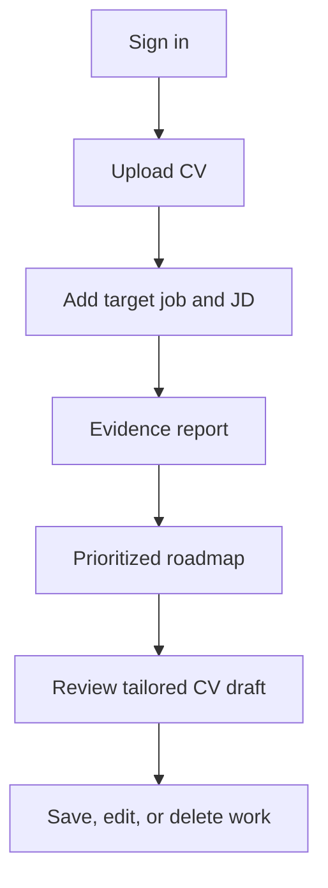
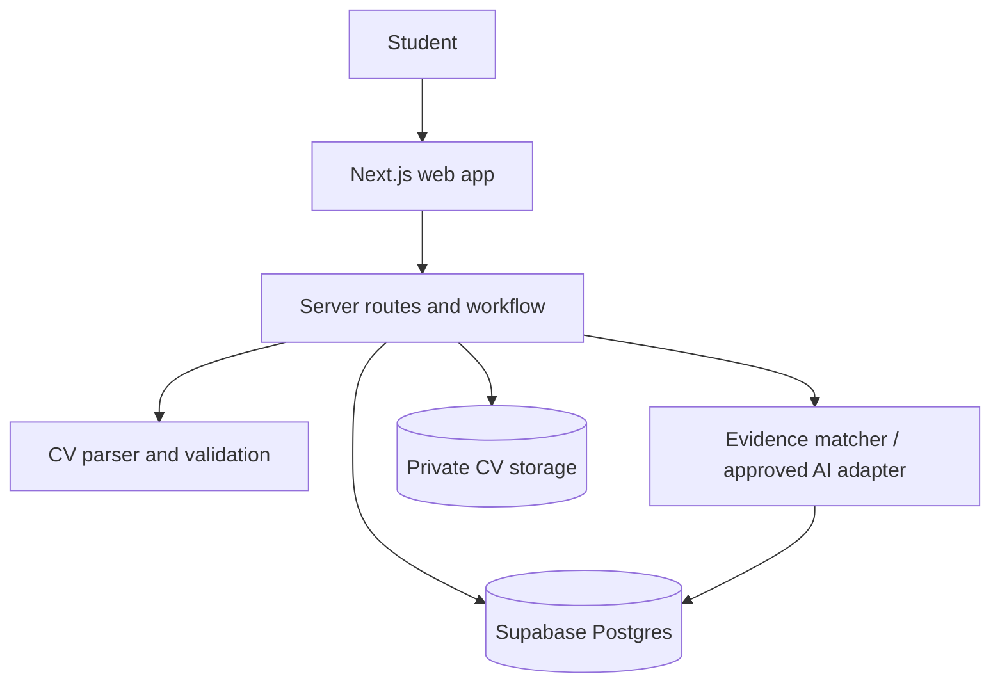

# EXE101 Web App — Master Plan and Progress Report

**Project:** EXE — AI Career Readiness Platform
**Report owner:** Project owner / team
**Last updated:** 2026-10-02
**Working branch:** `codex/exe-web-app-m6b`
**Live status:** Nothing is merged to `main`, deployed, or available to real users.

This is the single working report for the web app. It combines the product map, course delivery plan, engineering milestones, current evidence, decisions, acceptance checks, and next actions. Update this file whenever a section is completed.

## 1. Product map

### Product purpose

EXE helps a student or recent graduate compare their existing CV with one specific job description, understand what their CV actually supports, decide what to improve, and prepare a clearer role-specific CV without inventing qualifications.

### Core user

The first validated target segment is still open. The working hypothesis is students and recent graduates applying for internships or junior roles. CP2 research must choose one segment and job family before public launch or pricing decisions.

### Core promise

> From CV and job description to checkable evidence, clear gaps, practical next actions, and a truthful tailored CV draft.

### What makes it useful

| User problem | EXE response | Product rule |
|---|---|---|
| A job seeker does not know whether their CV demonstrates a job requirement. | Show a requirement-by-requirement finding with the relevant CV excerpt. | Evidence before claims. |
| Generic CV tools rewrite text without explaining gaps. | Label each requirement as supported, partly supported, unclear, or missing. | No opaque hiring score. |
| People need a practical next step. | Create a short roadmap tied to the gaps. | Actions must link to a specific finding. |
| Tailoring a CV can introduce false claims. | Create an editable draft with source provenance for every proposed claim. | Never invent skills, experience, metrics, or credentials. |
| CVs contain personal data. | Store documents privately with owner-scoped access and deletion controls. | Do not use real data before privacy review. |

### End-to-end user journey

### MVP boundaries

| Included in the course MVP | Deliberately deferred |
|---|---|
| Sign-in, private PDF/DOCX CV intake, pasted job description, evidence report, roadmap, grounded editable CV draft, saved work, deletion controls, responsive loading/error states | Payments, subscriptions, recruiter marketplace, job scraping, automatic job alerts, social profiles, mobile app, skill exams, automated public-profile collection |

## 2. Architecture map

| Area | Current implementation | Status |
|---|---|---|
| Web app | Next.js 16 + TypeScript + responsive assessment/report screens | Built |
| Identity | Supabase authenticated session access | Built; local acceptance passed in M1 |
| CV storage | Private owner-prefixed Supabase bucket; PDF/DOCX only; 5 MiB maximum | Built; local acceptance passed in M1 |
| Parsing | Server-side PDF/DOCX validation and normalized text extraction | Built |
| Target jobs | Owner-scoped role, company, and pasted job description | Built |
| Analysis | Server-side deterministic wording matcher; schema validation and traceable excerpts | Built in M2 |
| AI provider | No vendor selected and no CV/JD text sent externally | Open decision |
| Roadmap | Gap-linked actions, priority, rationale, and user-controlled progress | Built in M3; local policy acceptance pending |
| CV drafting | Source-grounded editable draft with per-claim provenance and explicit acceptance | Built in M3; local policy acceptance pending |
| Saved history / polish | Saved core work, empty/loading/error states, security and responsive review | Planned for M4 |

## 3. Engineering milestone plan

| Milestone | Scope and acceptance target | Status | Evidence / remaining work |
|---|---|---|---|
| **M0 — Web app shell** | Responsive UI, fictional report preview, CV/JD entry, browser-only validation | Complete; owner review pending | Build, lint, and typecheck passed. Branch: `codex/exe-web-app-m0`. |
| **M1 — Secure intake and identity** | Auth, private CV storage, PDF/DOCX parse, saved target jobs, replace/delete, ownership policies | Complete; accepted as M2 baseline | Two-user local Supabase RLS/private-Storage acceptance passed on 2026-10-01. Branch: `codex/exe-web-app-m1`, commit `7909dc8`. |
| **M2 — Evidence-based analysis** | Requirements, supported/partly supported/unclear/missing findings, excerpts, caveats, saved runs | Local Supabase acceptance passed; owner review pending | Two-user M1/M2/M3 RLS, private Storage, retry uniqueness, and deletion-cascade acceptance passed locally on 2026-10-02. Branch: `codex/exe-web-app-m2`. |
| **M3 — Roadmap and grounded CV draft** | Prioritized gap-linked actions; editable CV draft with claim provenance and review | Local Supabase acceptance passed; owner review pending | The local source composer remains provider-free. Two-user roadmap, draft, provenance, and deletion-cascade checks passed locally on 2026-10-02. |
| **M4 — Saved work and integration polish** | Minimal history, full core flow, error/empty states, responsive and privacy review | Complete; owner review pending | Private saved-work API/DTO, mobile-safe history UI, navigation, and calm state handling are implemented. All quality checks and local Supabase acceptance passed on 2026-10-02. |
| **M5 — CP1 Slot 8 demo readiness** | Fictional local demo package, 3–5 minute runbook, setup checklist, product/service and technology descriptions | Demo package complete; owner/course review pending | `45188c5`; fictional fixture and local acceptance passed; no course checkpoint marked complete. |
| **M6a — Private review links and feedback** | Private, revocable, expiry-limited sharing of one completed report and optional accepted draft | Implemented; final verification and owner review pending | Branch `codex/exe-web-app-m6` from `45188c5`; owner controls, narrow public reviewer route, hashed tokens, RLS/RPC boundary, and fictional local acceptance are implemented. |
| **M6b — Private opportunity links and curated-source framework** | Owner-saved external HTTPS reference links with private process status; future curation contract only | Implemented; final owner review pending | Branch `codex/exe-web-app-m6b` from `4ccb54d`; RLS, same-owner target-job guard, HTTPS validation, local acceptance, and empty curation framework are complete. No external fetching, scraping, or unverified listings. |
| **Release review** | Final owner review, security/privacy review, course demo preparation | Planned | Requires explicit owner approval before a merge or any deployment. |

## 4. M2 status and acceptance record

### Delivered

- Requirement extraction from the job description, capped at 12 requirements.
- Four user-facing findings: **supported**, **partly supported**, **unclear**, and **missing**.
- Exact CV excerpts plus offsets for wording evidence.
- Clear labels for self-reported CV claims and example context.
- No numerical hiring score, proficiency verdict, or job-offer prediction.
- No external AI calls. The current `local-evidence` adapter is deterministic wording matching only.
- Saved, owner-scoped analysis runs and findings with retry-safe request IDs.
- Owner-scoped database policies; source-CV deletion cascades to stored evidence.
- Report screen, processing state, retry path, and accessible plain-language limits.

### Automated checks already passed

| Check | Result |
|---|---|
| `pnpm test` | Passed: 5 test files, 33 tests |
| `pnpm lint` | Passed |
| `pnpm typecheck` | Passed |
| `pnpm build` | Passed |
| `node --check scripts/m1-local-policy-check.mjs` | Passed |
| `git diff --check` | Passed |

### M2 local acceptance

| Check | Why it matters | Current state | Completion command |
|---|---|---|---|
| Two-user local Supabase analysis RLS | Confirms users cannot read or write another user's analysis or findings | Passed 2026-10-02 | `pnpm dlx supabase start`; environment from `pnpm dlx supabase status -o env`; `pnpm test:supabase:local` |
| Cross-owner CV/job reference denial | Prevents an analysis run using another user's CV or JD | Passed 2026-10-02 | Included in the fictional-data acceptance script |
| Retry request uniqueness | Prevents duplicate reports after a network retry | Passed 2026-10-02 | Included in the fictional-data acceptance script |
| CV deletion cascade | Removes derived evidence with the source CV | Passed 2026-10-02 | Included in the fictional-data acceptance script |
| Owner UX review | Confirms wording is clear and useful for job seekers | Pending | Review the M2 branch with fictional data |

## 5. M3 implementation and acceptance record

M3 converts the M2 report into actions a job seeker can use. It stays evidence-grounded and uses fictional test data until the privacy, data retention, and AI-provider decisions are complete.

| Section | Build work | Acceptance criteria |
|---|---|---|
| Roadmap generation | Completed: derives up to five actions from missing, partial, and unclear findings | Every item saves the linked requirement, finding status, priority, action, rationale, and user-controlled progress state |
| Roadmap review | Completed: private screen shows priority, rationale, and progress control | A completed action records user progress and is never treated as skill verification |
| Grounded CV draft | Completed: composes only supported or partial evidence excerpts already found in the CV | Each generated claim stores its requirement, exact excerpt, and source offsets; no new facts or metrics are generated |
| Draft editing | Completed: direct editing, save, and explicit acceptance are available | Any edit clears prior acceptance and is labelled as the user's responsibility to verify |
| Safety checks | Completed: unit tests cover linked actions and source-only claim selection | The local composer excludes missing and unclear findings from the generated draft |
| Persistence and privacy | Implemented: owner-scoped roadmap, draft, and claim tables with deletion cascades | Passed local two-user RLS/cascade acceptance with Docker Supabase on 2026-10-02 |

## 6. M4 saved work and integration polish

### Delivered

- Added the private `/saved-work` workspace and owner-scoped `/api/saved-work` endpoint.
- The list returns only target role, optional company, CV filename, report dates/status, four derived finding counts, draft existence, and draft acceptance state. It never returns CV/JD text, excerpts, owner IDs, storage paths, or provider configuration.
- Added calm empty, loading, private-session/error, processing, failed-report retry, no-next-steps, and draft-review states.
- Added clear Saved work navigation from the overview, assessment, report, and next-step screens.
- Reviewed and adjusted responsive behavior for desktop and narrow mobile: wrapping long titles and filenames, reachability of actions, visible keyboard focus, status text that does not rely on colour, and labelled controls.
- Kept the deterministic local analysis/composer path. No external provider receives CV or job-description text.

### M4 verification

| Check | Result |
|---|---|
| `pnpm test` | Passed: 7 test files, 40 tests, including authenticated owner query scoping, unauthenticated rejection, cross-run metadata exclusion, derived summary counts, and empty data handling. |
| `pnpm lint` | Passed |
| `pnpm typecheck` | Passed |
| `pnpm build` | Passed; includes `/saved-work` and `/api/saved-work` |
| `node --check scripts/m1-local-policy-check.mjs` | Passed |
| `git diff --check` | Passed |
| `pnpm test:supabase:local` | Passed again against the isolated local Docker Supabase stack using temporary fictional users and content only. |

### Remaining limitations

- The saved-work list is intentionally a concise return-to-work index, not a source-data browser; users reopen a private report or draft for detail.
- A reviewed Supabase environment, backup/retention review, and owner privacy/security review are still required before accepting real CVs.
- M4 does not add payments, pricing claims, deployment, sharing, job links, or an external AI provider.

## 7. Course delivery map

Engineering progress does not automatically complete a course checkpoint. Each checkpoint needs its own evidence and team review.

| Checkpoint | Course requirement | Current status | Needed evidence |
|---|---|---|---|
| **CP1 — Idea lock** | Product/service description, target-user hypothesis, problem, value proposition, MVP boundary | Not started | One-page idea-lock summary and agreed demo scenario |
| **CP2 — Market research** | Survey of more than 100 responses or two qualified industry experts; 5–10 customer interviews; competitor, market, value, and price research | Not started | Dated sources, anonymized notes, consent approach, competitor matrix, and revised segment/value proposition |
| **CP1 — MVP demo** | End-to-end product demo plus product and technology description | Not started | Fictional-data demo of the full M0–M4 path |
| **CP3 — BMC** | Business Model Canvas supported by research or clearly labelled assumptions | Not started | BMC and evidence links |
| **CP4 — Pitch deck** | Team, product-market fit, business model, operations, fundraising plan | Not started | Slide deck, speaker plan, and research-supported claims |
| **Constructivism presentation** | Separate 15% assessment; rubric still needs confirmation | Not started | Instructor-confirmed rubric and working evidence log |

### CP2 research work that must happen before pricing claims

1. Select the primary job-seeker segment and sampling plan.
2. Conduct the required survey or expert interviews, then 5–10 target-user video interviews with consent-safe notes.
3. Compare current alternatives, including their pricing, privacy terms, and evidence quality.
4. Ask what users do today, where it fails, which feature matters most, use intent, and willingness to pay.
5. Label every claim as research evidence, estimate, assumption, or open question.
6. Use the findings to decide the initial segment, value proposition, and pricing. A lower price remains a hypothesis until this research exists.

## 8. Product and technical decisions

| Decision | Status | Reason / next action |
|---|---|---|
| Next.js + TypeScript web app | In use | Existing application foundation; record any stack change before making it. |
| Supabase Auth, Postgres, and private Storage | In use for M1–M3 | M1 local two-user policy acceptance passed; review backup/retention before real CVs. |
| PDF and DOCX only; 5 MiB maximum | Approved for M1 | Server validates extension, signatures, and DOCX archive structure. |
| Deterministic local analysis adapter | Reversible M2 choice | Avoids external CV/JD sharing while AI-provider data handling is unresolved. |
| External AI provider | Open | Choose only after cost, privacy, retention, consent, and output-evaluation review. |
| Numeric match score | Excluded from MVP | Categories with evidence are easier to understand and less likely to be mistaken for a hiring prediction. |
| Initial job segment and pricing | Open | Must be based on CP2 research. |
| Merge, deployment, or real-user use | Owner approval required | Keep feature branches reviewable; never deploy or merge without explicit approval. |

## 9. Privacy, security, and quality rules

- Never commit API keys, service-role keys, real CVs, interview recordings, or personally identifying research data.
- Keep CVs private and owner-scoped in both application logic and database/storage policies.
- Treat CV and job-description text as untrusted data; never execute it as instructions.
- Explain external AI data handling and obtain appropriate consent before any such use.
- Validate provider output before saving or displaying it.
- Preserve source evidence for findings and draft claims; mark uncertainty clearly.
- Give users clear delete, retry, loading, and error states.
- Use fictional or consented data in tests, screenshots, presentations, and demos.

## 10. Current work queue

| Order | Work item | Status | Owner / dependency |
|---:|---|---|---|
| 1 | Create this single master report | Complete 2026-10-02 | Completed in this branch |
| 2 | Run the expanded M2/M3 two-user acceptance script | Complete 2026-10-02 | Docker plus `pnpm dlx supabase` 2.119.0; fictional local accounts only |
| 3 | Record M2/M3 acceptance result and publish report update on the feature branch | Complete 2026-10-02 | Published in commit `45cc24f` |
| 4 | Build M3 roadmap and source-grounded CV draft | Complete 2026-10-02 | Code checks passed; local policy acceptance and owner review remain |
| 5 | Run CP2 research and approve target segment/value/pricing | Parallel product work | Team evidence and instructor guidance |
| 6 | Build M4 saved work and integration polish | Complete 2026-10-02 | Full quality gate and local acceptance passed; owner review remains |
| 7 | Prepare M5 CP1 Slot 8 demo readiness | Complete — owner/course review pending | Fictional demo data and DOCX fixture, local setup checklist, 3–5 minute runbook, product/service and technology descriptions, failure plan, owner checklist, and final automated checks are complete; owner must still rehearse/review before CP1 is marked complete |
| 8 | Build M6a private review links and feedback | Complete — owner review pending | Selected-report sharing with optional accepted draft, expiry, revocation, review feedback, narrow reviewer route, and fictional-data test evidence implemented |
| 9 | Build M6b private opportunity links and curated-source framework | Complete — owner review pending | Private user-saved HTTPS references, owner RLS/same-owner target-job enforcement/cascade, and an empty curation contract implemented; real curation remains blocked by CP2/team approval |
| 10 | Run CP2 evidence collection | Parallel product work | Validate segment, value, alternatives, competitor positioning, and willingness to pay; no pricing/lower-price claim before this research |
| 11 | Final owner review, then decide whether to merge/deploy | Owner decision only | Requires explicit privacy/security and backup/retention review plus explicit approval; no deployment or merge in M6b |

## 11. Progress log

| Date | Completed section | Result | Evidence |
|---|---|---|---|
| 2026-10-01 | M1 local policy acceptance | Passed with temporary fictional users on local Docker Supabase | `7909dc8`; `scripts/m1-local-policy-check.mjs` |
| 2026-10-01 | M2 implementation | Built and published for source review | GitHub commit `c0ab3d7` on `codex/exe-web-app-m2` |
| 2026-10-01 | M2 automated code checks | Passed: 33 unit tests, lint, typecheck, build, syntax/diff checks | `docs/CURRENT_STATE.md` |
| 2026-10-02 | Master project report | Created as the single tracking document | This file |
| 2026-10-02 | M3 roadmap and CV draft | Built private roadmap, source-grounded draft, editing/acceptance controls, owner-scoped storage, and deletion cascade migration | 35 unit tests; lint, typecheck, build, syntax, and diff checks passed |
| 2026-10-02 | M2/M3 local Supabase acceptance | Passed using temporary fictional accounts, CVs, and JDs only | Fixed duplicate Supabase migration versions by renaming M2 to `20261002` and M3 to `20261003`; ran `pnpm dlx supabase start` and `SUPABASE_URL="$API_URL" SUPABASE_PUBLISHABLE_KEY="$PUBLISHABLE_KEY" pnpm test:supabase:local` |
| 2026-10-02 | M4 saved work and integration polish | Completed private saved-work history, return links, responsive/accessibility refinements, and plain-language loading/empty/error states | 40 unit tests, lint, typecheck, build, syntax/diff checks, and a repeated local Supabase acceptance passed; no merge or deployment |
| 2026-10-02 | M5 Section 2 — fictional demo material | Completed demo persona, deterministic expected findings, local environment checklist, and upload fixture | `docs/demo/FICTIONAL_DEMO_DATA.md`; `docs/demo/DEMO_ENVIRONMENT_CHECKLIST.md`; parser-verified 1,489-byte fictional DOCX fixture |
| 2026-10-02 | M5 Section 3 — CP1 Slot 8 package | Completed 3–5 minute core-flow runbook, product/service and technology descriptions, failure plan, and owner review checklist | `docs/demo/CP1_SLOT8_DEMO_RUNBOOK.md`; `docs/demo/PRODUCT_SERVICE_DESCRIPTION.md`; `docs/demo/TECHNOLOGY_TOOLS_DESCRIPTION.md`; `docs/demo/CP1_SLOT8_OWNER_REVIEW_CHECKLIST.md` |
| 2026-10-02 | M5 Section 4 — final verification and tracking | Passed final code gate and fictional-data local Supabase acceptance; demo package marked ready for owner/course review | 40 unit tests, lint, typecheck, build, script syntax/diff checks, and two-user local RLS/Storage/analysis/roadmap/draft/cascade acceptance passed; live browser pixel review remains an owner checklist item because a connected browser was unavailable |
| 2026-10-02 | M6a Section 1 — baseline and branch setup | Passed clean M5 baseline checks; created and pushed M6 branch | Base `45188c5`; 40 tests, lint, typecheck, build, script syntax/diff checks, and fictional local Supabase acceptance passed; `codex/exe-web-app-m6` pushed without touching `main` |
| 2026-10-02 | M6a Section 2 — private review-link design | Defined focused selected-report sharing, hashed tokens, expiry, immediate revocation, anonymous RPC boundary, and exclusions | `docs/PRIVATE_REVIEW_DESIGN.md`; implementation follows in M6a Sections 3–5 |
| 2026-10-02 | M6a Section 3 — secure data model and server access | Implemented migration, owner RLS, direct-anonymous denial, token-hash RPC boundary, accepted-draft guard, and deletion cascade acceptance | `20261004_m6_private_review_links.sql`; local reset applied M1–M6a migrations and the fictional two-user policy suite passed |
| 2026-10-02 | M6a Section 4 — owner workspace UI | Implemented report-level create/copy-once controls, expiry selection, accepted-draft opt-in, owner share management, revoke, and scoped feedback display | `src/app/analysis/[id]/review-links.tsx` and authenticated `/api/analysis/[id]/review-shares` route; raw tokens do not appear in saved share records |
| 2026-10-02 | M6a Section 5 — reviewer UI | Implemented unlisted noindex/no-store reviewer view, neutral unavailable page, selected-content projection, and bounded feedback form | `/review/[token]` never appears in navigation and exposes no owner identity, IDs, source CV/JD, storage path, or unrelated work |
| 2026-10-02 | M6a Section 6 — verification and documentation | Passed final automated checks and reset local Supabase acceptance; documentation updated | 44 unit tests in 9 files, lint, typecheck, build, script syntax/diff checks, and M1–M6a fictional two-user acceptance passed; owner must still complete a live desktop/narrow-mobile review before any presentation or real-data decision |
| 2026-10-02 | M6b Section 1 — baseline and branch setup | Passed clean M6a baseline checks; created and pushed M6b branch | Base `4ccb54d`; 44 tests, lint, typecheck, build, script syntax/diff checks, and M1–M6a fictional local Supabase acceptance passed; `codex/exe-web-app-m6b` pushed without touching `main` |
| 2026-10-02 | M6b Section 2 — opportunity-link design | Defined private user-provided tracker and empty future-curated-source lanes | `docs/OPPORTUNITY_LINKS_DESIGN.md`; no scraping, external fetching, vacancy verification, recommendations, or real sources/listings |
| 2026-10-02 | M6b Section 3 — secure private tracking | Added owner-scoped opportunity storage, APIs, validation, tests, and fictional local acceptance coverage | Migration `20261005_m6b_private_opportunity_links.sql`; same-owner target-job FK, RLS, HTTPS-only validation, cascade deletion, no external URL fetch behavior |
| 2026-10-02 | M6b Section 4 — job-seeker workspace | Added private `/opportunities` add/edit/status/delete interface and contextual private-link entry points | Shows no IDs, CV/JD text, evidence, review links, or technical database errors; external navigation is disclosed and delete needs confirmation |
| 2026-10-02 | M6b Section 5 — future curation framework | Added empty typed source catalog contract and team curation standard | No unverified real listings/sources; CP2 research and documented team approval are required before any real curated source is shown |
| 2026-10-02 | M6b Section 6 — verification and documentation | Passed all quality gates and reset local Supabase acceptance; documentation updated | 51 unit tests in 10 files, lint, typecheck, build, script syntax/diff checks, and M1–M6b fictional two-user acceptance passed. Static responsive review passed; connected-browser desktop/narrow-mobile review remains an owner task before any real-data, merge, or deployment decision. |

## 12. How to resume

1. Have the owner rehearse and review the **M5 CP1 Slot 8 fictional-data demo package**, including a desktop and narrow-mobile visual pass. Do not mark CP1 complete without team/course evidence.
2. Begin **CP2 evidence collection** before claims about segment, pricing, lower price, competitors, or market demand.
3. Complete final owner privacy/security and Supabase backup/retention review before any merge, deployment, or real CV use.
4. Review M6b opportunity add/edit/delete and empty/error states at desktop and narrow-mobile widths; keep real curated sources disabled until CP2 evidence and team approval exist.

## 13. Source documents

- [Project scope and build plan](PROJECT_SCOPE_AND_PLAN.md)
- [Engineering build tracker](APP_BUILD_TRACKER.md)
- [Current state](CURRENT_STATE.md)
- [Decision log](DECISIONS.md)
- [Course checkpoint tracker](CHECKPOINT_TRACKER.md)
- [Phase prompts](PHASE_PROMPTS.md)
