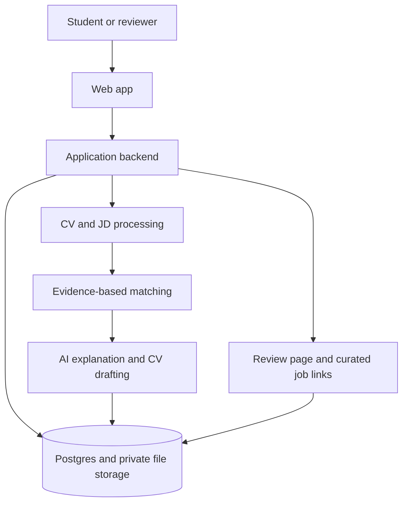

# EXE Project Scope and Build Plan

**Project:** AI Career Readiness Platform  
**Course:** EXE101  
**Status:** Planning baseline, awaiting the team's idea lock and research validation  
**Source documents:** `EXE.docx` and `HƯỚNG DẪN CÁC CHECKPOINT_EXE101.docx`

## 1. Product definition

The platform helps students and recent graduates move from a current CV to a more informed application decision for a specific role. A user provides a CV and a target job description (JD). The system identifies which requirements the CV supports, which are only partly supported, which are unclear, and which appear missing. It then suggests next steps and helps the user present existing experience more clearly.

The product's outcome is not simply a prettier CV. It is a practical path:

**Current CV → evidence and skill gaps → prioritized actions → stronger role-specific CV → optional expert feedback → relevant job opportunities.**

### Problem statement to validate

Students and new graduates often do not know whether their CV demonstrates the requirements of a particular job, what evidence is missing, or what they should do next. Existing CV tools may improve wording without showing whether the applicant can support the job's requirements.

This is a problem hypothesis, not yet a proven market finding. Use Checkpoint 2 research to validate its importance and the team's target segment.

### Initial user segments

- Second-year students beginning career exploration and building a first CV.
- Third-year students applying for internships or junior roles.
- Students approaching graduation who want to assess readiness before applying.
- Recent graduates adapting their CV to specific openings.

For the first pilot, choose one segment and one job family after customer research. IT internships/junior roles are a possible starting hypothesis because the brief gives Backend, Frontend, and Data Analyst examples; this choice is not yet validated or locked.

## 2. Product principles

1. **Evidence before claims.** A finding should point to the CV text, section, project, or experience that supports it.
2. **No invented qualifications.** AI must not create skills, degrees, projects, results, certifications, employers, or experience the user did not provide.
3. **Separate claim from proof.** A skill written in a CV is self-reported. A relevant project or work example is supporting evidence, not independent verification. Mark external verification only when a real verification source exists.
4. **Make uncertainty visible.** Use supported, partly supported, unclear, and missing labels. Avoid presenting a match score as a hiring prediction.
5. **User controls sharing.** CVs and reports are private by default. A review link must be explicitly created and revocable.
6. **AI is advisory.** Explain that analysis may be incomplete and is not a hiring decision or guarantee of employment.
7. **Build the core loop first.** Keep integrations, payments, and marketplace features out of the first course MVP.

## 3. Scope boundaries

### MVP — required end-to-end value flow

- Minimal sign-in and career profile sufficient to save the user's work.
- Upload a CV in supported formats (initially PDF and DOCX), show file and extraction status, and provide understandable error states.
- Enter a target role and paste a JD. For the demo, a manually entered JD is sufficient.
- Extract and organize relevant CV and JD content.
- Produce a report containing:
  - requirements identified in the JD;
  - supported, partly supported, unclear, or missing status for each requirement;
  - a CV evidence excerpt or an explicit “no evidence found” note;
  - CV clarity or completeness issues;
  - caveats where the source document is ambiguous.
- Produce a short, prioritized learning or project roadmap connected to identified gaps.
- Generate an editable CV draft for the target role based only on the user's source information; show changes and let the user accept or edit them.
- Keep a small analysis history or one saved result so the user can return to the demo.
- Provide privacy controls appropriate for the prototype, including deletion of uploaded CV data and the associated extracted data.
- Include a clear loading state, retryable error state, and a demo-safe sample CV/JD with consent or fictional data.

### Optional thin features — only after the core loop works

- A shareable expert-review page with a user-created, revocable link and a simple feedback form.
- A small curated set of job-board or employer links relevant to the target role. Links can be manually curated for a class prototype.
- Download/export of the edited CV, if time and implementation choices allow.

### Explicitly deferred beyond the course MVP

- Paid subscriptions, payment processing, and billing administration.
- A full recruiter/mentor marketplace, scheduling, messaging, or payouts.
- Large-scale job scraping, automated job-board integrations, and job alerts.
- Large company or candidate datasets, social/community features, and automatic public-profile collection.
- Mobile apps, portfolio/GitHub verification, automated skill exams, and a full career-history tracker.
- Any guarantee that analysis or use of the platform will result in an interview or job offer.

## 4. Main user flow and screens

1. **Welcome and account:** explain the service and privacy basics; sign in or create a demo account.
2. **Career profile:** collect only information needed for the first analysis; do not require a long profile before the user can try the core flow.
3. **CV upload:** select a file, show upload/processing status, allow replacement or deletion, and explain parsing failures.
4. **Target job:** enter a role title, company (optional), and JD text. A role title without a JD can be a later enhancement; the MVP should work with pasted JD text.
5. **Analysis in progress:** show progress and provide a safe retry path without creating duplicate confusing reports.
6. **Results:** summarize matched, partial, unclear, and missing requirements with supporting CV evidence and caveats.
7. **Next steps:** present prioritized learning/project actions with an explanation linking each action to a gap.
8. **CV editor:** show the existing content and proposed changes side by side; keep each claim traceable to source information.
9. **Optional review:** create a private review link and view expert comments.
10. **Optional opportunities:** display curated job links and state clearly that the links are suggestions, not confirmed matches.

## 5. Proposed technical architecture

The course materials do not prescribe a stack. The working proposal is a **single modular web application**, not a set of microservices:

- **Web app and server endpoints:** Next.js with TypeScript. Keep the user interface and server-side orchestration in one repository/app for the MVP.
- **Authentication, relational data, and file storage:** Supabase Auth, Postgres, and private Storage buckets. Enforce user ownership in both application code and database/storage policies.
- **AI calls:** a server-side provider adapter. Keep API credentials on the server; validate provider outputs against application schemas before storing or rendering them.
- **Document parsing:** a server-side parser module for the supported file types. Preserve section/page context when available so findings can reference source evidence.
- **Quality checks:** format/lint, TypeScript checking, unit/integration tests, production build, and a GitHub Actions workflow. Use the tooling selected during the foundation phase.

If the team chooses a different stack, record the reason and the resulting changes to hosting, document parsing, storage privacy, testing, and the course technology description in `docs/DECISIONS.md`.

### Architecture flow

### Application modules

| Module | Responsibility | MVP boundary |
|---|---|---|
| Account and profile | Authentication, ownership, minimal career context | Basic only; no social profiles |
| CV intake | Secure upload, parsing, extraction status, deletion | PDF/DOCX first; no image/OCR pipeline unless research/demo requires it |
| JD intake | Role title and pasted JD; structured requirement extraction | Manual input; no job-board crawling |
| Analysis orchestrator | Coordinate parsing, matching, AI explanation, persistence | One run per CV/JD combination is enough initially |
| Evidence matcher | Associate JD requirements with relevant CV passages | Transparent categories and traceable passages; no opaque hiring score |
| Roadmap | Convert gaps into prioritized learning/project actions | Short, actionable suggestions with rationale |
| CV editor | Generate and edit a role-specific draft | Grounded in the user's content; changes reviewable before use |
| Expert review | Share selected report content and collect feedback | Optional simple form; no marketplace or payment |
| Opportunity links | Show relevant external sources | Optional curated links; no automated ingestion |

### Suggested core records

- `UserProfile`: owner, display name, education/career context, consent settings.
- `CvDocument`: owner, private storage key, file type, processing state, extracted text/profile, created/deleted timestamps.
- `TargetJob`: owner, role title, optional company, JD text, extracted requirements.
- `AnalysisRun`: owner, CV document, target job, status, created timestamp, analysis/provider version.
- `RequirementFinding`: analysis run, requirement text/category, status, evidence excerpts/source locations, explanation, uncertainty.
- `RoadmapItem`: analysis run, linked finding, action type, priority, suggested outcome, completion state.
- `CvVersion`: owner, source CV, target job, draft content, provenance for changed claims, created timestamp.
- `ReviewShare`: owner, selected analysis/CV version, hashed token, expiration/revocation state, access metadata.
- `ExpertReview`: share, reviewer-provided name/role (optional), feedback, timestamp.
- `JobOpportunityLink`: role/category, title, source, URL, date checked; can be static seed data in the MVP.

Do not create every table before the first vertical slice. Keep the schema minimal and add entities only when a user flow needs them.

## 6. Privacy, safety, and reliability requirements

- Never commit API keys, service-role keys, OAuth secrets, real CVs, interview recordings, or personally identifying research data.
- Keep CV files in private storage. Do not use public object URLs. Check authenticated ownership on every read, write, and delete.
- Explain whether CV text is sent to an external AI provider; obtain appropriate user consent before doing so and use only sample/consented data for the class demo.
- Treat uploaded text and JD content as untrusted data, not as instructions to the AI system.
- Limit accepted file types and sizes; reject malformed files safely; handle parser and provider errors without exposing secrets or raw stack traces.
- Validate AI responses against a schema; reject or retry malformed output. Store a provider/model/prompt version where practical for reproducibility.
- Findings must not claim that a user possesses a skill solely because the model inferred it. Show the source passage, label self-reported claims, and mark ambiguous evidence as unclear.
- CV drafts must preserve facts and avoid fabricated metrics or achievements. The user must review and accept a draft before exporting or sharing it.
- Delete the original file and associated extracted content when the user deletes their CV, subject to the prototype's documented storage behavior.
- Review links must be unguessable, scoped to the selected content, revocable, and time-limited where feasible. Never expose the full account or CV library through a review link.
- Use fictional/sample records for screenshots, presentations, and public demos unless a participant explicitly consented.

## 7. Phase-by-phase build plan

### Phase 0 — Project control and documentation baseline (now)

**Tasks**
- Keep this scope and course tracker as the single planning baseline.
- Create a decision log for stack, initial customer segment, supported CV formats, AI-provider data handling, and optional features.
- Assign a team owner and reviewer for product/research, frontend, backend/data, AI/analysis, and presentation tasks; one person may own multiple roles.
- Create a shared location for dated research evidence and consent-safe sample assets.

**Exit criteria**
- Team knows the MVP and deferred scope.
- Open course ambiguities have an owner and due point.
- No code work depends on undocumented assumptions.

### Phase 1 — Idea lock and CP1 preparation (Slot 3)

**Tasks**
- Select the first customer segment as a hypothesis, not a proven fact.
- Write a one-sentence problem, target user, proposed service, differentiator, and expected outcome.
- Map the user journey and choose the smallest scenario to demonstrate later.
- Prepare the product/service description and technology-tools description requested by CP1.
- List assumptions that CP2 research must test.

**Exit criteria**
- Team can explain the value in 60 seconds.
- MVP flow and excluded scope are agreed.
- CP1 Slot 3 evidence is ready.

### Phase 2 — Market validation and CP2 (Slot 5)

**Tasks**
- Plan a survey with more than 100 responses **or** interview at least two qualified industry experts, as stated in the guide.
- Separately conduct 5–10 target-customer interviews by video; prepare a consent approach and retain evidence safely.
- The guide also mentions “5 target customers, 5 suppliers” and “hub.” Confirm whether these are additional requirements. To cover a stricter reading, aim for at least five target-user and five supply-side interviews (e.g., recruiters, career advisors, mentors, or job-opportunity providers) if the course allows.
- Ask what users do now, where the current process fails, whether they would use the proposed service, which feature matters, and expected price.
- Research industry outlook, market size, trends, segments, key players, market share where reliable, and existing product/service pricing.
- Compare competitors and substitutes; connect findings to the value proposition and market fit.
- Label evidence, estimates, assumptions, and unknowns separately. Never invent responses or market statistics.

**Exit criteria**
- CP2 results and analysis are documented with dated sources and sample details.
- The target segment and MVP scope are updated from evidence.
- A competitor/value-proposition comparison is ready to present.

### Phase 3 — UX, architecture, and implementation foundation (after scope validation)

**Tasks**
- Draw screen flows and low-fidelity screens for upload, job input, report, roadmap, and CV editing.
- Agree on the chosen stack and record an architecture decision.
- Define data ownership, schemas/contracts, loading/error/empty states, and file-processing limits.
- Scaffold the app, linting/type checking/tests, environment examples, CI, and a minimal responsive layout.
- Configure local/demo behavior without requiring production secrets.

**Exit criteria**
- App starts locally and CI checks pass.
- Design and data boundaries are documented.
- No domain workflow is hidden in a large untestable component.

### Phase 4 — CV and JD intake vertical slice

**Tasks**
- Implement sign-in/demo identity and minimal profile if required by the chosen architecture.
- Upload a supported PDF/DOCX privately; validate ownership, file type, and size.
- Parse CV text and expose processing status, parse errors, and delete/retry actions.
- Accept role title and pasted JD; persist it to the user's account.
- Add fixtures for CVs and JDs using fictional data.

**Exit criteria**
- A user can securely upload a sample CV and save a target job.
- Invalid or unreadable files produce recoverable errors.
- Tests cover ownership and basic upload/parse behavior.

### Phase 5 — Evidence-based analysis engine

**Tasks**
- Extract job requirements into a validated structure.
- Match each requirement to CV evidence; provide a source excerpt/location where available.
- Return supported/partial/unclear/missing, explanation, caveat, and confidence/uncertainty without unsupported hiring predictions.
- Persist an analysis run and render a readable report.
- Keep analysis provider calls server-side and protect against prompt injection in CV/JD content.
- Test deterministic examples, missing evidence, ambiguous wording, malformed AI output, provider errors, and retry behavior.

**Exit criteria**
- A complete report renders from a sample CV and JD.
- Every “supported” finding has a relevant cited CV passage; missing evidence is explicitly stated.
- Tests show the system does not convert model guesses into user facts.

### Phase 6 — Roadmap and grounded CV drafting

**Tasks**
- Turn the highest-priority gaps into concrete study/project actions and explain why each matters for the target JD.
- Draft role-specific CV text from supplied facts only.
- Show source/provenance for rewritten claims and a before/after review.
- Allow edits and explicit user acceptance; add export only if the core flow is stable.

**Exit criteria**
- Roadmap actions map to report findings.
- Draft preserves source facts and does not add unsupported achievements or metrics.
- User can review and edit before using or sharing the draft.

### Phase 7 — Optional expert review and job links

**Tasks**
- Add a user-created, revocable, narrowly scoped review link and a basic feedback form.
- Add curated job links only if the core MVP is stable; record source and date checked.
- Make clear that reviewers and external job sites are independent and a link is not a guaranteed match.

**Exit criteria**
- Shared content is limited, consented, and revocable.
- No marketplace, payment, or automated job scraping has slipped into scope.

### Phase 8 — Integration, privacy review, and CP1 Slot 8 demo

**Tasks**
- Run end-to-end tests on the upload → JD → analysis → roadmap → CV draft flow.
- Check responsive layout, accessibility basics, loading/empty/error states, deletion behavior, and user isolation.
- Prepare a fictional/consented demo dataset and a 3–5 minute script.
- Prepare fallback screenshots or a recorded flow only if permitted by the course.
- Rehearse the product/service and technology description.

**Exit criteria**
- Demo works from a fresh account using sample data.
- All core acceptance criteria below pass.
- Team can explain current limits honestly.

### Phase 9 — Business Model Canvas and CP3 (Slot 8)

**Tasks**
- Use market research to fill customer segments, value proposition, channels, relationships, revenue, key resources, activities, partners, and cost structure.
- Separate validated facts from assumptions.
- Reconcile any proposed Free/Pro or expert-review pricing with research; do not present a guessed price as validated.

**Exit criteria**
- Every major BMC choice has a research rationale or is clearly marked as an assumption.
- BMC is consistent with the MVP and operational capacity.

### Phase 10 — Pitch deck and CP4 (Slot 10)

**Tasks**
- Prepare Option 1 as the working rubric: Team profile 10%, Product-market fit 40%, Business model 20%, Operations 20%, Fundraising plan 10%.
- Support product-market fit with survey/interview evidence and a competitor comparison.
- Describe product status accurately; distinguish working code, prototype, and roadmap.
- Show operations, team responsibilities, cost assumptions, and a realistic fundraising plan.
- Check with the instructor whether Option 2 exists and whether the team may choose it.

**Exit criteria**
- Deck addresses every listed rubric item and fits the assigned presentation time.
- No fabricated traction, market share, interview quote, partnership, or financial result.

### Phase 11 — Constructivism presentation and learning evidence

**Tasks**
- Keep a dated decision log: initial assumption, evidence/action, what changed, and why.
- Collect team contribution notes, prototype versions, research method, feedback, and iteration examples.
- Ask for the missing Constructivism rubric and tailor the presentation when received.

**Exit criteria**
- Presentation can explain how the team built understanding through research, feedback, and iteration.
- Evidence is consent-safe and consistent with course instructions.

### Phase 12 — Post-course roadmap (not part of MVP commitment)

Possible future work, subject to new validation: deeper CV/job intelligence, skill assessment, learning-roadmap progress, portfolio/GitHub evidence, career profile/history, mentor marketplace, employer partnerships, job alerts, and mobile clients. Revalidate privacy, technical cost, and demand before implementation.

## 8. MVP acceptance checklist

- [ ] User can sign in or enter the agreed demo identity.
- [ ] User can upload a sample CV and see parse status.
- [ ] User can provide a specific JD.
- [ ] The report shows supported, partial, unclear, and missing requirements.
- [ ] Supported requirements show relevant CV evidence; unsupported requirements do not invent evidence.
- [ ] The roadmap is prioritized and linked to report findings.
- [ ] CV draft uses only user-provided facts and is editable before acceptance.
- [ ] User's CV and report are private to that user; deletion works.
- [ ] Failures are understandable and recoverable.
- [ ] Tests, lint, type check, and production build pass.
- [ ] Demo uses fictional or explicitly consented data.
- [ ] Expert sharing and job links are either safe and functional or clearly excluded from the demo.

## 9. Risks and controls

| Risk | Control |
|---|---|
| Scope grows into a full employment platform | Freeze the core CV-to-JD loop; gate optional modules behind core acceptance |
| AI fabricates ability or experience | Evidence citations, structured output validation, provenance, user review, adversarial fixtures |
| CV data is exposed | Private storage, ownership checks, no real CVs in Git, deletion, scoped share links |
| Research is too weak or biased | Use the stated sample/interview targets; document sample limitations and exact method |
| Match score is mistaken for hiring probability | Prefer categories and evidence; explain any score formula and its limits |
| Slot 8 has both MVP demo and BMC | Prepare a shared evidence base early; assign separate owners and rehearse both deliverables |
| Course rubric is ambiguous | Track “hub,” suppliers, Constructivism rubric, and CP4 Option 2 as instructor questions |
